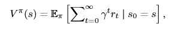

# CPR

## Efficient and Stable Offline-to-online Reinforcement Learning via Continual Policy Revitalization

## 理解任务（做什么）

CPR（持续策略焕新）是一种离线→在线强化学习的稳定微调方法。

它定期重置策略网络，恢复学习能力；同时保存所有历史策略形成策略集合，用组合动作保证在线稳定；再用自适应约束让新策略靠近历史最优行为。

最终解决传统方法性能暴跌、学不动的两大问题，实现高效稳定的离线到在线迁移。

我们提出了持续策略振兴(CPR),这是一种 新颖的高效、稳定的微调方法。

CPR采用周期 性策略振兴技术,在确保初始性能稳定的同时 ,将过度训练的策略网络恢复到完全学习能力 。这种方法能够在不受低质量预训练策略不利 影响的情况下进行微调。

与以往研究不同, CPR在策略优化中使用**自适应策略约束**来初始 化新策略。这种优化使新策略接近从历史策略 构建的行为策略。这有助于稳定的策略改进和 最优的收敛性能。实际上,CPR可以通过最小 的修改无缝集成到现有的离线RL算法中。


> 我们的贡献主要体现在两个方面: 
>
> 首先,识别和分析与直接策略初始化相关的问题,有实证证据支持;
>
> 其次 ,引入了一种稳定且高效的O2O强化学习方法,称为持续 策略振兴(CPR)。
>
> **策略振兴**和**自适应策略约束**的结合在学习过程中提供了稳定性和效率 。


## 动机（为什么做这个）

现有方法存在**不稳定性**和**低样本效率** 的问题。

两大致命问题：

1. **分布偏移（Distribution Shift）**

   预训练策略只见过离线数据，在线环境一交互就遇到大量没见过的动作，Q 值乱估 → **性能瞬间暴跌**。

   

2. **首要偏差（Primacy Bias）**

   预训练策略在数据集上**过度训练**，网络 “学死了”，**丧失继续学习的能力** → 在线微调怎么学都上不去。


> 现有工作主要集中在减轻直接策略初始化带来的负面 影响。已经提出了几种O2O算法来缓解这种分布转移问 题。不幸的是,这些方法都有其缺点。此外,首因偏差 问题在以前的O2O RL背景下尚未被识别。


### 直接策略初始化的问题

> 分布转移
>
> “通过离策略强化学习算法的线 上到线下强化学习(O2O RL)在初始阶段会出现性能下 降,这归因于分布转移” (Zhao 等, 2024, p. 4318)
>
> 我们训练了一个从在相同任务上预训练的 AWAC[Nair等人,2020年]模型初始化的SAC策略  [Haarnoja等人,2018年]。我们观察到性能下降与Q值函 数的严重价值高估同时出现。因此,我们假设调优阶段 的分布转移会导致众所周知的外推误差问题[Fujimoto等 人,2019年],并且外推误差进一步导致性能下降
>
> 在在线异策略学习 中,情况不会太糟,因为在训练阶段当策略执行这些动 作时,高估的值会得到纠正。然而,这个问题在离线强 化学习中会加剧,因为策略没有机会与环境交互来修正 其价值估计。在这种情况下,分布外动作处的价值估计 外推误差会通过自举不断放大,使Q值估计不可靠。
>
> 在线上到线下强化学习的初始阶段,在线缓冲区只包含少数样 本,这使得许多动作分布外,并且对其中一些动作的外推价值 估计可能相当高。因此,策略有动机偏离预训练策略并选择这 些分布外动作,这立即导致性能下降。


### 策略的实际持续学习能力


## 方法原理（怎么做的）

**CPR 不直接用 pre-trained policy 做初始化！**

而是：

- 保留 pre-trained policy 进**策略集合**
- 周期性**重新初始化新策略**（焕新）
- 让新策略拥有学习能力，同时靠策略集合保证稳定

CPR = 不让策略 “学死”，定期 “复活” 一个新策略，同时把老经验都留住，让离线→在线微调又稳又快。

**CPR 到底在做什么？（3 个核心动作）**

**① 定期 “焕新” 策略 —— 解决 “学死了”**

- 每隔一段时间，**扔掉旧策略，重新初始化一个全新策略**
- 新策略 = 一张白纸，**学习能力满血复活**
- 但价值网络（Q 网络）不动，保证性能不会掉

👉 作用：**彻底解决首要偏差，让模型永远能继续学**

**② 建一个 “策略档案馆” —— 解决 “忘光光”**

- 不删掉旧策略，而是**全部存进一个集合里**
- 在线选动作时，**所有老策略一起投票**，按 Q 值选最好的动作

👉 作用：**不忘历史经验，保证上线不崩、不暴跌**

③ **自适应约束 —— 解决 “乱学、跑偏”**

- 不让新策略乱来，**逼着它靠近 “所有老策略的最优组合”**
- 用行为克隆（BC）简单实现

👉 作用：**稳！稳！稳！上线不炸性能**

**传统方法**：

让一个**学了几十年、思维固化的老教授**直接去学新知识 → 学不动、还容易出错。

**CPR 方法**：

1. 老教授**经验保留**（存进策略库）
2. 定期换一个**聪明、学习快的新学生**（策略焕新）
3. 新学生**照着老教授们的最优经验学**（自适应约束）
4. 学得又快又稳，还不会忘本事


CPR旨在在策略振兴阶段用新振兴的 策略取代过度训练的离线策略。

这个振兴的策略开始时 是一张白纸,保持对新知识的接受能力,而历史策略则 保存在策略集中以防止遗忘。

为了平衡学习和遗忘,我 们**组合所有现有策略**来决定选择哪个动作。**新策略通过 具有自适应策略约束的高效离线训练进行初始化**。

策略振兴和自 适应策略约束的结合在学习过程中提供了稳定性和效率 。


> 我们首先使用预训练策略从在线环境收 集10000个转移元组,并用SAC算法更新策略。然后,我们保持 策略不变,使用在线数据通过额外的梯度步骤更新Q值函数。之 后,冻结Q值网络,我们进行1000步梯度的策略改进。如表1所 示,由于价值外推误差和策略偏差的放大,额外的更新会损害 性能。
>
> 我们的分析和实证结果表明,为了实现稳定的微调过程,在 线微调更新中应避免访问分布外动作,特别是在开始阶段。这 需要对策略更新添加约束,以使访问分布不太远离离线数据集 。当离线数据集不可访问时,我们应该让策略接近离线训练的 策略


### 持续策略复兴技术

策略集合、混合策略这个机制

- 你论文里的**这个机制**（比如策略集合、自适应约束、混合策略等）
- **protects the policy from …**：保护策略**不被……**
- **radical forgetting**：**剧烈遗忘 / 灾难性遗忘**
- **radical policy improvement**：**过于激进、过猛的策略更新**

------

整句最直白意思

这个机制做了两件关键的事：

1. **不让模型突然忘掉之前学的东西**（防灾难性遗忘）
2. **不让新策略更新得太猛、太极端**（防止一步改太大，把策略改崩）

------

论文正式版（可直接抄）

该机制有效**抑制了策略的灾难性遗忘**，并**避免了过于激进的策略更新**，保证持续学习过程稳定可靠。


### 讨论复兴后 策略约束的适当设计


与 PPO 中的**迭代策略约束**相比，该约束仅要求更新后的策略与**上一轮旧策略**保持接近。

------

大白话解释

1. **PPO 里的迭代策略约束**

   

   - 只看**上一轮的自己**
   - 新策略 ≈ 上一轮旧策略
   - 只和**最近一次**的策略比

   

2. **这句话想表达的意思**

   

   - 你们 PPO 只是**自己跟自己比**
   - 而我们的方法（比如 CPR）是**跟整个历史策略集合 / 行为策略比**
   - 我们的约束**更强、更稳定、更能防止外推误差和灾难性遗忘**


### 给出实际实现

算法 1：CPR 完整白话解释

先记住整体思路

CPR = 离线强化学习 + **策略复兴（把旧策略拿回来当安全约束）**

一边学新策略，一边定期存一个 “靠谱策略” 进集合，防止学崩、遗忘。

输入（Input）

- Pre-trained policy πβ：**预训练好的初始策略**（比如 BC 预训练）
- Parameter µ：**预训练好的 Q 网络参数**
- Revitalization interval Tr：**策略复兴间隔**（每隔多少步存一个新策略）

第 1 行：初始化

```
1: Initialize
   k ← 0,
   µ₁, µ₂ ← µ (双Q网络用预训练参数初始化),
   D ← ∅ (在线回放池为空),
   Π ← {π_β} (策略集合先放进初始预训练策略)
```

**大白话：**

- 用**预训练模型**开局
- 建一个空的经验池 D
- 建一个策略集合 Π，先把**初始安全策略**放进去

第 2–15 行：每个 epoch 循环

```
2: for each epoch do
3:   for each sampling step t do
```

- 一轮一轮训练
- 每一步 t 都采样、交互、更新

------

第 4 行：选动作

```
4: Select action with probabilities specified by Eq. 2
```

**大白话：**

按照**混合策略（当前策略 + 历史策略）** 来选动作，保证安全、不跑偏。

------

第 5 行：存经验

```
5: D ← D ∪ {(sₜ, aₜ, r(sₜ,aₜ), sₜ₊₁)}
```

把这一步的 **状态、动作、奖励、下一个状态** 存进回放池 D。

------

第 6–9 行：训练 Q & 策略

```
6: if k > 0 then
7:   用随机梯度下降最小化 Eq.7 → 更新 Q 网络
8:   用随机梯度下降最小化 Eq.6 → 更新策略 π
9: end if
```

**大白话：**

只要不是第 0 轮，**每一步都训练**：

- 让 Q 更准（Eq.7）
- 让策略更好，同时**BC 正则 / KL 约束** 防止跑偏（Eq.6）

------

第 10–13 行：策略复兴（核心！）

```
10: if t % Tᵣ == 0 then
11:   最小化 Eq.6 初始化新策略 πₖ₊₁，加入集合 Π
12:   k ← k + 1
13: end if
```

**大白话：**

每隔 Tr 步，就**保存一个当前策略**到集合里：

- 这个新策略是**安全、稳定、靠谱**的
- 以后用来做**混合策略、约束新策略**
- 防止遗忘、防止崩

这就是 **CPR = Consensus Policy Restoration 策略复兴**。

------

整段极简总结（上台直接讲）

> CPR 算法先使用预训练模型初始化，
>
> 在训练过程中，**每一步都根据混合安全策略采样、存数据、更新 Q 与策略**，
>
> 并**每隔固定步数保存一个稳定策略到集合中**，
>
> 通过不断复用历史安全策略来约束更新，实现**稳定、不崩、不遗忘**的离线强化学习。


## 实验

### 6.1实验设置

任务和离线数据集。我们从D4RL [Fu等人, 2020]中选择流行的Mu-JoCo运动任务作为性能比较的基准。为模拟不同质量的离线数据集,每个任务设置了随机和三个中等水平。

离线训练协议。所有离线算法均使用1000个随机小批次进行1000个 轮次的训练。对于每种算法,我们运行5个随机种子。最后一个检 查点文件用作预训练模型。

在线训练协议。我们使用5个随机种子对所有方法运行300个 episode。在每个episode中,有1000个在线交互步骤。

我们比较以下基线:  • TD3 [Fujimoto等人,2018年],它代表了使用在线强化学习从头开始学 习的性能。  • TD3+BC [Fujimoto和Gu,2021年],它在TD3的策略更新损失上添加 了一个BC正则化项。作为一种纯离线强化学习算法,我们通过离 线数据集初始化一个离线缓冲区。  • TD3+BC-FT [Beeson和Montana,2022年],它在TD3+BC中退火BC项的 权重以进行微调。  • AWAC [Nair等人,2020年],它在策略改进步骤中执行KL散度约束 。  • IQL [Kostrikov等人,2022年],它使用期望分位数回归来学习策略。 IQL可以直接转移到在线微调,无需任何修改。  • PEX [Zhang等人,2023年],它冻结预训练策略并添加一个可学习策略 用于在线学习。**扩展处:定期添加**


### CPR 和其他方法比起来怎么样？


### 6.3节

我们的持续政策振兴方法能否缓解首因偏差问 题并防止遗忘?(见图4和第6.3节)


## 名词解释

Pre-trained policies = 离线数据集上提前训练好的策略，用于离线→在线强化学习的初始化。但直接用它初始化会导致分布偏移和首要偏差，让在线微调崩溃、学不动。

### **分布偏移（Distribution Shift）**

预训练策略只见过离线数据，在线环境一交互就遇到大量没见过的动作，Q 值乱估 → **性能瞬间暴跌**。

### **首要偏差（Primacy Bias）**

预训练策略在数据集上**过度训练**，网络 “学死了”，**丧失继续学习的能力** → 在线微调怎么学都上不去。


### supervised fine-tuning（监督微调）

**一句话：用标注数据，把一个预训练好的模型，再训练一遍，让它适配新任务。**

它是什么？

- **supervised** = 有监督 = 有标准答案（标签）
- **fine-tuning** = 微调 = 在已经训练好的模型上，小幅度改一改参数

合起来：

**用带标签的数据，小幅度更新预训练模型，让它做得更准、更贴合当前任务。**

2. 举个最通俗的例子

- 预训练模型：一个**已经学会认字、说话**的大模型

- 微调数据：**医疗问答的问答对（问题→标准答案）**

- 监督微调：

  让模型照着这些标准答案再学一会儿 → 变成

  医疗专用模型

### 3. 这篇论文里为什么要提它？

论文里有一句关键对比：

> 大家以为 RL 的离线→在线微调，会像 **监督微调** 一样**越调越好**。
>
> 但现实是：**RL 里直接微调预训练策略，会越调越烂！**

对比一眼看懂

- 监督微调（如大模型）：

  预训练模型 → 用标注数据微调 → 

  一定变更好

- 传统离线→在线 RL：

  预训练策略 → 在线微调 → 

  性能暴跌、学不动

所以论文才说：

**RL 的直接初始化微调，和监督微调完全不一样，必须用 CPR 来救。**


在线微调 = Online Fine-Tuning

一句话：

在真实环境里，一边和环境互动，一边继续训练预训练好的策略，让它变得更强。

------

1. 先搞懂两个词

- 在线（Online）：

  和真实环境实时互动

  机器人动一下、游戏走一步、小车转一下…… 都是在线。

- **微调（Fine-Tuning）**：**在已经训练好的模型上，小改参数，让它更厉害**

合起来：

**在线微调 = 让预训练模型，在真实环境里边试边学，继续变强。**

------

2. 完整流程（超级简单）

1. 先离线训练

   用现成数据集，训练出一个 

   预训练策略

   （不用动环境）。

2. 再在线微调

   把这个策略放进真实环境，

   一边交互、一边更新

   ，让它越来越强。

👉 这就叫 **Offline-to-Online（离线→在线）**。


### 直接策略初始化

我们将这种 “用离线训练好的模型权重来初始化并更新策略网络” 的范式，称为直接策略初始化。

2. 组会大白话（你上台直接讲）

这句话就是给**传统做法**起个名字：

> 以前大家做离线→在线强化学习，
>
> **直接把离线训练好的模型拿来当起点，直接在线接着训**，
>
> 这种做法就叫 **直接策略初始化**。


### extrapolation error propagation（外推误差传播）

模型遇到没见过的动作 / 状态，乱估一个很高的 Q 值，然后越学越错，误差越滚越大，最后直接崩掉。

1. 先拆词

- **Extrapolation**：外推 = 对**没见过的东西**瞎猜
- **Error**：误差 = 猜得不对
- **Propagation**：传播 = 误差越滚越大、越传越广

合起来：

**外推误差传播 = 模型对没见过的动作瞎估价值 → 估错了 → 误差不断放大 → 策略彻底坏掉**


### Distribution Shift（分布偏移）

**超级大白话：离线学的东西，和在线真实环境不一样 → 模型一上场就 “水土不服”。**

------

1. 最直白解释

- **离线数据里的状态、动作** = 模型**见过、学过**的东西
- **在线环境里的状态、动作** = 模型**没见过、超出范围**的东西

这两种**不一样**，就叫 **Distribution Shift（分布偏移）**。


### over-conservatism = **过度保守**

离线学习不能随便探索，为了**避免选到危险 / 没见过的动作**，算法会：

- 把**没见过的动作 Q 值压得很低**
- 强迫策略**只模仿离线数据**
- 不敢更新、不敢突破

结果：

**策略变得很 “乖”，但也很 “笨”，只会重复旧经验。**

在线微调本来要**继续变强、探索更好的动作**，

但因为**过度保守**：

- Q 函数**不敢更新**
- 策略**不敢选新动作**
- 在线学习**完全卡住，涨不上去**

👉 **过度保守 = 把在线微调 “锁死” 了**


### Primacy Bias = **首要偏差 / 先入为主偏差**，`也可以叫首要偏见`

1. 离线训练时，策略在**数据集上练了太久、练太熟**
2. 网络参数被**牢牢固定**，形成**先入为主**的记忆
3. 拿到在线环境微调时：
   - **学不进新东西**
   - **涨不动性能**
   - **可塑性完全丢失**

👉 **Primacy Bias = 策略被离线训练 “教死了”，丧失继续学习的能力**


### asymptotic performance = **渐近性能 / 最终收敛性能**

**模型训练到最后、几乎不再涨分时，能达到的**最高最终分数

因为首要偏差（学死了），模型最后能达到的最高分被废掉了，永远达不到本来能达到的水平。


### adaptive policy constraint = **自适应策略约束**

不让新策略乱跑，但也不把它锁死在旧策略里；约束目标会跟着学习自动变好、自动升级。

**policy constraint**：策略约束 = 限制新策略不能离 “靠谱策略” 太远

**adaptive**：自适应 = **约束的目标不是固定的，会越变越好**


### 价值函数 V^π(s)



**V^π(s) = 从状态 s 出发，按照策略 π 一直玩下去，未来能拿到的**总奖励期望 **。

逐部分拆开（超级简单）

1. V^π(s)

- **V**：价值（Value）

- **π**：你用的策略

- s：当前状态→ 

  在状态 s，按策略 π 玩，最终能得多少分

2. E^π[ … ]

- E：期望（Expectation）→ 

  平均下来能拿多少分

  （不是某一次，是长期平均）

3. Σ（从 t=0 到 ∞）γ^t r_t

- **r_t**：第 t 步拿到的奖励
- **γ^t**：折扣因子（越远的奖励越不重要）
- **Σ**：把未来所有奖励加起来

→ **未来所有奖励的加权总和**

4. | s₀ = s

- 从**状态 s**开始


### Q^π(s,a) 一句话大白话

**在状态 s 选动作 a，之后一直按策略 π 玩，未来能拿到的**长期平均总奖励 **。**

------

逐词拆开（超级简单）

- **Q**：动作价值（评价这个动作好不好）
- **π**：你用的策略
- **s**：当前状态
- **a**：当前选的动作
- **E^π**：按策略 π 执行的**平均期望**
- **γ^t r_t**：未来每一步的折扣奖励
- **s₀=s, a₀=a**：从状态 s 开始，**第一步必须选动作 a**

------

和 V (s) 的区别（一定要懂！）

- **V^π(s)**：我在状态 s，**按策略玩**，最后能得多少分？
- **Q^π(s,a)**：我在状态 s，**先选动作 a**，之后再按策略玩，最后能得多少分？

👉 **Q 比 V 多了 “指定第一步动作”**


### J(π) = Eₛ~ρ [ V^π(s) ]

一句话大白话：

策略 π 的

总体得分 ** = 从随机初始状态出发，平均能拿到多少长期奖励。**

------

逐部分拆开（超简单）

1. **J(π)**

   策略 π 的**总性能、总回报、最终得分**

2. **s ~ ρ**

   初始状态 s 从 **初始分布 ρ** 里随机采样

   → 游戏一开始，随机出生在某个状态

3. **E[ … ]**

   求**平均值**

4. **V^π(s)**

   在状态 s 用策略 π 玩，能拿到的**长期奖励**

------

整句合起来（人话）

从游戏随机起点开始，按策略 π 一直玩，

平均下来能得到多少分 → 这就是 J (π)。

J (π) 是策略的目标函数，表示从初始状态分布出发，按照策略 π 执行，得到的平均状态价值，也就是策略的总体性能。


### 离线强化学习

与真实环境的在线交互可能成本高昂或不安全,在这种 情况下,离线强化学习算法[Levine等人,2020]更受青睐 。


### SAC（Soft Actor-Critic）算法

是一种基于**最大熵强化学习**框架的**离线 Actor-Critic 算法**

SAC = 让智能体在**最大化长期奖励**的同时，**最大化策略的随机性（熵）**，用 “软” 的方式平衡探索与利用，在机器人、自动驾驶等连续控制任务中表现极强。

二、核心思想：最大熵目标（最关键）

传统 RL 只追求：**最大化累积奖励**

SAC 改成：**最大化（奖励 + α× 熵）**

- **熵 H (π)**：衡量策略的随机性，越大动作越多样、探索越强
- **温度 α**：控制 “探索” 权重，α 越大越鼓励随机动作
- **目标**：既拿高分，又不钻牛角尖、不早收敛到局部最优

三、四大核心组件（网络架构）

SAC 用**4 个神经网络**，结构清晰、训练稳定：

1. 策略网络 π_φ（Actor）

   - 输入：状态 s
   - 输出：动作的概率分布（通常是高斯分布，输出均值 + 标准差）
   - 作用：生成**随机动作**，天然支持连续空间

   

2. 双 Q 网络 Q_θ1、Q_θ2（Critic）

   - 输入：(s,a)
   - 输出：动作价值 Q (s,a)
   - 作用：用**双 Q 取最小**，解决 Q 值过估计问题，提升稳定性

   

3. 目标 Q 网络 Q̄_θ̄

   - 作用：提供稳定的训练目标，用 ** 软更新（Polyak）** 缓慢同步主网络参数

   

4. 温度 α 网络（可选）

   - 自动学习 α，不用手动调参，自适应平衡探索与利用


### 软更新（Polyak 更新）

**目标网络不一下子全换掉，而是**一点点、慢慢地**靠近当前网络，让训练超级稳。**

 它解决什么问题？

强化学习里有两个网络：

- **当前 Q 网络**：一直在学、一直在变
- **目标 Q 网络**：用来算训练目标，**不能变太快**

如果**硬更新**：

每隔几步直接把参数**全部覆盖** → 训练震荡、炸了。

软更新就是：

**每次只挪一小步，不突变。**

------

2. 公式大白话

```plaintext
目标网络 ← 0.995 * 旧目标网络 + 0.005 * 当前网络
```

- **0.995**：大部分保留原来的（稳）
- **0.005**：只吸收一丢丢新参数（慢更）

👉 **每次只更新 0.5%，超级平滑。**


### extrapolation error problem

**外推误差问题**外推误差问题，是指离线强化学习在遇到分布外、没见过的状态和动作时，Q 函数会产生严重的错误估计，导致策略选择变差、训练不稳定甚至崩溃。

智能体在离线数据里没见过的动作 / 状态，Q 函数会乱估、瞎猜，而且越估越错，最后训练崩掉。

- **离线学习**：智能体**只能看数据集**，不能随便探索。
- 数据集里只有**一部分动作、状态**。
- 在线微调时，智能体**一定会遇到没见过的动作**。
- Q 函数**没见过就乱输出一个很高的值**。
- 这就叫 **extrapolation（外推）**。
- 乱估出来的错，就叫 **extrapolation error（外推误差）**。

2. 为什么这是个大问题？

1. Q 瞎估 → 策略以为这个动作很好
2. 策略拼命选这个动作
3. 实际奖励很低
4. 误差越滚越大，**Q 完全不准，策略崩掉**

你只学过**平地走路**（离线数据）

现在让你走**悬崖边**（没见过的动作）

你觉得 “应该没问题”（外推）

结果直接掉下去（误差爆炸）


### Drop Ratio = **丢弃率 / 替换率**

一句话大白话

**在策略集合里，每隔一段时间，把**最老、最早**的那个策略丢掉，用**新训练出来的策略

替换进去。

这个 “丢掉旧策略” 的比例 / 频率，就是 Drop Ratio。

------

1. 它是干嘛的？

在 CPR 这类算法里，会维护一个**固定大小的策略集合**：

- 集合里存最近训练的一批策略
- 用来做**自适应策略约束**
- 防止**首要偏差（学太死、学太旧）**

Drop Ratio 就是控制：

**多久丢一次旧策略，换新策略进来。**

------

2. 超简单例子

- 策略集合最多放 **10 个策略**
- 每训练一段时间，**删掉最老的 1 个**
- 这个 **1/10 = 0.1** 就是 Drop Ratio

作用：

**让集合里只保留 “近期、新鲜” 的策略，不被远古策略带偏。**


### AWAC（Advantage Weighted Actor-Critic）

**AWAC（Advantage Weighted Actor-Critic）**

是一种**离线预训练 + 在线微调**的强化学习算法

**一句话大白话**：**先用离线数据（专家演示 / 旧经验）快速学个不错的策略，再用少量在线数据微调，全程靠 “优势加权” 防止乱探索、避免外推误差，训练又快又稳**。

AWAC：**离线预训练 + 在线微调**的桥梁，既利用历史数据加速，又能在线迭代到更好。

**Actor 更新时，给 “优势高的动作” 加权重、多学；给 “优势低的动作” 降权重、少学；同时用 KL 约束让新策略别偏离离线数据太远，防止外推误差**。

三、关键机制（组会直接讲）

### 1. 优势加权（Advantage Weighting）

- 优势函数 A (s,a) = Q (s,a) - V (s)，衡量 “这个动作比平均好多少”。

- AWAC 的策略梯度不是普通梯度，而是

  按优势加权：

  ∇J(θ)≈E(s,a)∼D[exp(τA(s,a))⋅∇logπθ(a∣s)]

  - 优势正、大 → exp (...) 大 → 梯度大 → 多学这个动作。
  - 优势负、小 → exp (...) 小 → 梯度小 → 少学 / 不学这个动作。

  

- 作用：**只学 “有用的动作”，过滤掉差动作，避免被离线数据里的坏样本带偏**。

### 2. KL 约束（防止外推 / 乱探索）

- 优化目标：最大化优势期望 + 

  约束新策略与行为策略（离线数据来源）的 KL 散度

  。

  πk+1=argmaxπE[Aπk(s,a)]s.t.DKL(π∥πβ)≤ϵ

- 作用：**不让策略跑到离线数据没覆盖的区域，从根源抑制外推误差**。


### uniform random policy

**均匀随机策略**

一句话定义

在**所有可选动作里，每个动作被选中的概率都完全相等**，就是均匀随机策略。

------

超级大白话

- 动作有多少个，每个动作的概率就是 **1 / 动作总数**
- **不偏不倚，完全随机乱选**

------

例子

- 动作：左、右、上、下（共 4 个）

- 均匀随机策略：

  

  P (左)=0.25，P (右)=0.25，P (上)=0.25，P (下)=0.25

------

在论文里用来干嘛？

- 通常作为**最基础、最笨的策略**
- 用来**初始化探索**
- 用来**对比性能下限**

------

组会 10 秒背诵版

**均匀随机策略，是指智能体在所有可选动作中，以完全相同的概率随机选择动作，没有任何偏好。**


### 自适应策略约束

**一句话定义：**

**让新策略不能离 “之前靠谱的策略 / 数据分布” 太远，并且这个限制会随着训练自动变松或变紧，这就叫自适应策略约束。**

------

1. 它到底在干嘛？

你可以把它理解成：

**给策略更新加一个 “安全范围”**

- 新策略不能乱变
- 不能跑到**离线数据没见过的区域**
- 防止 **Q 瞎估、外推误差、训练崩溃**

**自适应 = 约束不是固定死的，会自动调整**

- 学得稳 → 约束**松一点**，允许多探索
- 学得飘 → 约束**紧一点**，不让跑偏

------

2. 超简单比喻

- 旧策略 / 数据集 = **人行道**
- 新策略 = **你走路**
- 约束 = **不让你走出马路**
- 自适应 = **路宽的时候让你走宽点，路窄的时候夹紧点**

👉 **自适应策略约束 = 动态安全护栏**

------

3. 在论文里通常怎么实现？

一般用这两种：

1. KL 散度约束

   

   新策略和旧策略 / 行为策略的距离不能太大

2. 策略集合约束

   

   新策略必须靠近之前保存的

   好策略

然后**根据当前训练情况自动调整约束强度**，所以叫**自适应**。


### catastrophic forgetting

**灾难性遗忘 / 灾难性崩溃遗忘**

一句话定义

模型在**学习新任务 / 新知识**时，**突然、彻底、快速地忘掉之前学过的旧知识**，这种现象就叫灾难性遗忘。

------

大白话解释

- 先学会了 **任务 A**
- 再去学 **任务 B**
- 结果**任务 A 直接忘光**
- 不是慢慢忘，是**一下子崩掉** → 灾难性

超简单例子

- 先学会：**开车**

- 再去学：**骑电动车**

- 学会电动车后，

  突然不会开车了

  

  → 这就是

  灾难性遗忘

  。

------

在强化学习 / 持续学习里是什么？

- 旧策略、旧环境、旧任务学得很好
- 学新策略、新环境、新任务
- **旧策略性能直接暴跌、几乎归零**
- 导致模型**不能持续学习**


### 单步策略提升

**在每一次动作选择时，我们都执行一步**带最大熵的单步策略提升 **。**

------

逐词拆开大白话

1. **at every action selection step**

   每一步选动作的时候

   

2. **we perform a one-step policy improvement**

   我们做**一步策略提升**

   → 就用**当前这一步**的信息，把策略变得更好一点

   → 不是等到最后再更新，是**每一步都小更一下**

   

3. **with maximal entropy**

   带上**最大熵**

   → 既要让奖励更高，又要让策略**尽量随机、探索充分**

   

------

整句最通俗意思

每选一次动作，就立刻用当前信息做一步小更新，

在让策略变好的同时，保持策略的随机性（探索能力）。


### 评估动作质量

混合策略（你论文里的策略集合加权出来的那个）

**相反，当 η 较小时，混合策略会根据候选动作的评估价值做出贪心决策。**

------

超直白解释（你上台就这么讲）

- **η**：控制**探索程度**的系数
- **small η**：探索很弱、几乎不探索
- **mixed policy**：混合策略（你论文里的策略集合加权出来的那个）
- **greedy decisions**：贪心选择，**只选价值最高的动作**
- **evaluated action quality**：Q 值 / 优势函数评估出来的动作好坏

整句人话：

当 η 很小的时候，混合策略就不怎么随机探索了，

只会老老实实选 Q 值最高、评分最好的动作，变得很贪心。

------

论文正式版（可直接写）

**相反，较小的 η 会降低混合策略的探索程度，使其依据动作价值评估结果，趋向于贪心选择最优动作。**


### 迭代策略正则化

**一句话定义：**

在**每一轮迭代更新策略**时，都**加一个约束**，不让新策略和上一轮旧策略**差得太远**，这就叫**迭代策略正则化**。

------

大白话解释

- 你每训练一步，都会得到一个**新策略**

- 迭代策略正则化就是：

  

  新策略 ≈ 旧策略 + 一点点改进

- 不让新策略**突变、乱跳、跑偏**

- 一步步慢慢更新，**稳、平滑、不崩**

本质：

**用 “上一轮的自己” 来约束 “这一轮的自己”，防止更新太激进。**

------

超简单比喻

- 旧策略 = 你现在的位置

- 新策略 = 你下一步要走到哪

- 迭代正则化 = 

  每次只能迈一小步，不能跨一大步

  

  👉 防止一步迈太大，直接摔坑里。

------

论文正式版（直接抄）

**迭代策略正则化是在策略迭代过程中，通过约束新策略与上一轮旧策略之间的距离，抑制策略更新幅度，避免训练不稳定与灾难性遗忘，提升离线与持续强化学习的稳定性。**


### 行为策略（behavior policy）

一句话定义

**行为策略 = 产生你手里这批离线数据的那个策略。**

也就是：**数据是谁 “做出来的”，谁就是行为策略。**

------

大白话解释

- 你现在有一批**离线数据**（状态、动作、奖励）
- 这些数据不是天上掉下来的
- 是**之前某个策略**在环境里一步步走、选动作、收集来的
- 那个**收集数据时用的策略**，就叫 **行为策略**

------

超简单例子

- 之前用一个 **SAC 策略** 收集了 100 万条经验

- 现在你用这批数据做 **离线强化学习**

- 那么：

  - **数据来源 = 原来的 SAC 策略**
  - 它就叫 **行为策略**

  

------

在离线 RL 里的作用

行为策略非常关键，因为：

1. 你的数据**完全由它决定**

2. 你训练新策略时，

   不能偏离它太远

   

   不然就会出现 

   外推误差、Q 瞎估

3. 很多算法（AWAC、CPR、BCQ）都用它来做 **约束**

------

论文正式版（直接抄）

**行为策略是指在交互过程中产生离线数据集的策略，是离线强化学习中数据分布的来源，常被用于约束新策略以避免外推误差。**


### 带约束的策略更新

这就是「带约束的策略更新」：

新策略要尽量让 Q 值变大，但又不能离旧的混合策略太远。

------

1. 符号先认全（你只要记住这几个）

- πk：**这一轮要学的新策略**
- argmaxπ：**找一个策略 π，让后面的东西最大**
- Qπ(s,a)：动作价值，**这个动作好不好**
- π^k：**旧的混合策略 / 行为策略**（之前靠谱的那个）
- DKL(π^k∥π)：**两个策略之间的距离**
- ϵ：**允许的最大距离**（很小的数）

------

2. 上半部分：目标

πk=argmaxπEs∼ρπ^kEa∼π(⋅∣s)Qπ(s,a)

**大白话：**

> 我们要**找到一个新策略 π**，
>
> 让它在当前状态分布下，
>
> 选出来的动作 **Q 值尽可能大**。

→ 就是**让策略变得更厉害、回报更高**。

------

3. 下半部分：约束（s.t. = subject to）

s.t.Es∼ρπ^kDKL(π^k(⋅∣s)∥π(⋅∣s))≤ϵ

**大白话：**

> 但是！
>
> 新策略 π**不能离旧的混合策略 \**π^k\** 太远**。
>
> 它们之间的 KL 散度（距离）**必须小于 \**ϵ\****。

→ **不许跑偏、不许乱探索、防止外推误差**。

------

4. 整句合起来（你上台直接这么讲）

> 这一步是在**更新第 k 轮策略**：
>
> 我们希望新策略的 **Q 值越大越好**，
>
> 同时用 **KL 散度约束** 限制它，
>
> **不能偏离旧的混合策略太多**，
>
> 保证策略更新**稳定、安全、不崩**。


### π(・|s) 是什么？

**π(・|s) = 在状态 s 下，所有动作的概率分布**

------

拆开讲（超简单）

- **π** = 策略
- **s** = 当前状态
- **|s** = 给定状态 s
- **·** = **所有动作** 的简写

所以：

**π(・|s) = 给定状态 s，策略 π 对每个动作的打分 / 概率**

------

大白话例子

假设动作只有：左、右

在状态 s 下：

- π(左 | s) = 0.7
- π(右 | s) = 0.3

那么

**π(・|s) 就是这一整组概率：[0.7, 0.3]**

------

论文 / 公式里怎么理解？

- 看到 

  π(a|s)

  ：

  

  指

  某个具体动作 a

   的概率

- 看到 

  π(·|s)

  ：

  

  指

  全部动作的整个分布


### target policy distribution

**目标策略分布**

一句话定义

**你最终想要学到、想要使用的那个策略，它对应的动作概率分布，就叫目标策略分布。**

------

超简单大白话

- **target policy** = 你**最终要训练出来**的策略
- **distribution** = 它在每个状态下，选择各个动作的**概率**

合起来：

**target policy distribution = 目标策略在状态 s 下，输出的动作概率分布。**

------

和行为策略对比（必懂）

- **behavior policy distribution**：**收集数据**时用的策略分布
- **target policy distribution**：**你真正想训练、想部署**的策略分布

离线强化学习里：

我们用**行为策略的数据**，去学**目标策略**。

------

论文正式版（直接抄）

**目标策略分布是指智能体最终期望学习到的、用于实际决策的策略所对应的动作概率分布。**


### state visitation distribution

**状态访问分布**

一句话定义

**在某个策略下，智能体在环境中**会以多大概率、多频繁地遇到各个状态 **，这个概率分布就叫状态访问分布。**

------

大白话解释

- 智能体按照策略去走

- 有的状态**经常走到**

- 有的状态**几乎不去**

- 把每个状态被访问到的

  频率 / 概率

  画出来

  

  → 这就是 

  state visitation distribution

可以理解成：

**智能体在环境里的 “足迹分布”**。

------

超简单例子

- 状态：A、B、C

- 策略下：

  - A 出现 60%

  - B 出现 30%

  - C 出现 10%

    

    这一组概率就是 

    状态访问分布

    。

  

------

在强化学习里有什么用？

1. 决定了**我们主要在哪些状态上学策略**
2. 策略不同，状态访问分布**完全不同**
3. 离线 RL 里，它就是**数据里状态的分布**

------

论文正式版（直接抄）

**状态访问分布是指智能体在执行某一策略时，环境中各个状态被访问到的概率分布，反映了策略在状态空间中的访问偏好与轨迹特征。**


### composed policy distribution

**组合策略分布 / 合成策略分布**

组合策略分布是由多个历史策略与当前策略加权融合得到的动作概率分布，用于提升离线强化学习与持续学习过程中的稳定性与鲁棒性。


### Behavioral Cloning (BC)

**行为克隆（BC）**

------

一句话定义

**BC = 把专家的动作当成标签，用监督学习直接学 “状态→动作” 的映射，是最简单的模仿学习。**

------

大白话解释

1. 你有一堆**专家数据**（状态 s，动作 a）

2. BC 不管奖励、不管策略、不管长期回报

3. 只做一件事：

   

   看到 s，就尽量输出和专家一样的 a

4. 本质就是个**分类 / 回归任务**

👉 **死记硬背专家的行为，不会自己思考。**

------

超简单比喻

- 专家 = 老司机
- 你 = 新手
- BC = 你**只看老司机怎么打方向盘**，然后**一模一样模仿**
- 不理解为什么要这么开，**只抄动作**


### 公式翻译

π=argminπEs∼ρπ^k,a∼π^k(logπ^k(a∣s)−logπ(a∣s))

**中文：**

在混合策略 π^k 的状态与动作分布下，**最小化对数概率差**，从而得到最优策略 π。

------

一句话核心

**这就是在做：行为克隆（BC）+ 最小化 KL 散度。**

------

逐词拆开大白话

1. ***\*argminπ\****

   找一个策略 π，让后面那一项**越小越好**。

   

2. ***\*Es∼ρπ^k,a∼π^k\****

   在**混合策略 \**π^k\** 产生的状态和动作**上求平均。

   

3. ***\*logπ^k(a∣s)−logπ(a∣s)\****

   

   - π^k(a∣s)：**混合策略**选动作 a 的概率
   - π(a∣s)：**你要学的新策略**选动作 a 的概率
   - 相减 = 衡量两个策略**差多远**

   

4. **整体含义**

   让新策略 π(a∣s)**尽量等于**混合策略 π^k(a∣s)。

   

------

最通俗理解

> 让新策略拼命模仿混合策略，
>
> 动作概率越像越好，越像损失越小。


似然损失用于衡量策略对示范动作的拟合程度，最小化该损失等价于让策略尽可能模仿示范分布，是行为克隆的核心优化目标。


### 似然性（Likelihood）

一句话：

在当前策略下，

“出现这个动作” 这件事有多合理、概率有多高 **，就叫似然性。**

------

超级大白话

- 动作是 **a**
- 状态是 **s**
- 策略是 **π**

**似然性 = π(a|s)**

就是：

**在状态 s 下，策略 π 认为动作 a 有多 “像它自己会选的”。**

- 概率高 → 似然性**大**
- 概率低 → 似然性**小**

------

放到你的强化学习里

你在做**行为克隆 BC**：

- 专家 / 混合策略选了动作 a

- 你要让你的新策略 π

  

  也觉得这个动作 a 很合理、概率很高

这就叫：

**最大化似然性**

= 让新策略**越像专家越好**。

再简单一点

**似然性 = 像不像我。**

似然性表示在给定策略与状态下，选取对应动作的概率大小，反映策略对该动作的支持程度。在行为克隆中，最大化似然性等价于让策略尽可能模仿示范动作。


### BC 正则化

**BC 正则化 = 用行为克隆（BC）的思想，让新策略去模仿旧的 / 安全的策略，起到稳定、约束、防止跑偏的作用。**

------

大白话解释

- 正常 BC：**单纯模仿专家**
- BC 正则化：**把模仿当成一种约束**，加在你的强化学习更新里

作用就两件事：

1. **不让新策略变得太极端、太离谱**
2. **让新策略始终靠近之前靠谱的策略（混合策略 / 行为策略）**

本质：

**用 “模仿” 当刹车，稳住训练。**

------

在你论文（CPR / 离线 RL）里的意思

- 旧策略：混合策略 π^k（安全、可靠）

- 新策略：π（正在训练）

- BC 正则化 = 让 

  π

   尽量

  模仿 **π^k**

  

  也就是最小化你刚才看到的

  对数似然损失 / KL 散度

------

超精简论文版（直接抄）

BC 正则化通过**最小化新策略与安全参考策略之间的 KL 散度或对数似然损失**，将策略更新限制在可靠的数据分布范围内，有效抑制分布偏移与训练不稳定。


### 公式翻译

λ=Qˉξ,Qˉ=E(s,a)∼D[∣Qμ(s,a)∣]

------

1. 每个东西是什么

- ***\*D\****：你的**离线数据集**
- ***\*(s,a)∼D\****：从数据里采样的 **状态 - 动作对**
- ***\*Qμ(s,a)\****：**行为 / 混合策略**对应的 Q 值
- ***\*∣Qμ(s,a)∣\****：Q 值的**绝对值**
- ***\*Qˉ\****：数据集中所有 **|Q| 的平均值**
- ***\*ξ\****：一个预先设定的**小常数**（超参数）
- ***\*λ\****：**自适应的正则化系数**

------

2. 大白话解释

1. ***\*Qˉ\** 是什么？**

   Qˉ=E(s,a)∼D[∣Qμ(s,a)∣]

   就是：

   把数据里所有 Q 都取绝对值，然后**求平均**。

   它代表：**你的 Q 值大概有多大**。

   

2. ***\*λ=ξ/Qˉ\** 是什么？**

   

- 如果 Q 很大 → Qˉ 大 → λ **变小**
- 如果 Q 很小 → Qˉ 小 → λ **变大**

所以：

**λ 是一个跟 Q 值大小成反比的、自适应的正则化系数。**

------

3. 它在算法里干嘛用？

这个 λ 一般是乘在 **BC 正则项 / KL 散度** 前面：

Loss=RL 损失+λ⋅BC 正则项

作用：

- Q 值很大时，**正则变弱**，让策略专心学奖励
- Q 值很小时，**正则变强**，让策略**老老实实模仿、别乱更新**

一句话：

**λ 让正则化强度自动适配 Q 值的尺度，让训练更稳。**

------

4. 论文里直接抄的解释

λ=Qˉξ,Qˉ=E(s,a)∼D[∣Qμ(s,a)∣]

其中 Qˉ 表示离线数据集上行为策略 Q 值绝对值的期望，ξ 为常数。

λ 是**自适应正则化系数**，用于根据 Q 值的尺度自动调节 BC 正则化或策略约束的强度，保证策略更新在不同奖励尺度下均稳定可靠


### BC 正则项是什么？

**BC 正则项 = 让新策略 “模仿” 旧策略的那一项损失，用来当 “刹车”，不让策略学太疯。**

------

超简单大白话

- 你在做强化学习，策略总想**往奖励高的地方冲**
- 冲太猛就会**跑偏、崩掉、灾难性遗忘**
- 所以加一项：**逼着新策略去模仿安全的旧策略（混合策略 / 行为策略）**
- 这一项就叫 **BC 正则项**

------

对应到你论文里的公式

通常长这样：

BC 正则项=DKL(π^∥π)

或者

BC 正则项=−logπ(a∣s)

**意思就是：**

新策略 π 要**尽量像**旧策略 π^

越像，这一项就越小。

BC 正则项通过最小化新策略与安全参考策略之间的 KL 散度或对数似然损失，实现对策略更新的约束与正则化，提升训练稳定性。


### offline batch updates

**离线批量更新**

------

一句话大白话

**不跟环境实时交互，只拿固定的一批离线数据，反复批量采样、批量算梯度、批量更新策略。**

离线批量更新是指在离线强化学习中，基于固定的离线数据集，通过分批采样数据进行梯度计算与模型参数更新，整个过程无需与环境进行在线交互。


### replay buffer

**回放缓冲区 / 经验回放池**

replay buffer = 存放智能体之前玩过的 “经验数据” 的池子，用来反复学习、反复训练。

- 智能体和环境交互，产生**一条条经验**（状态、动作、奖励、下一个状态）
- 这些经验**存进 replay buffer**
- 训练时，**从池子里随机抽一批数据**出来学习
- 用完**不扔掉**，可以反复用

就像：

**把之前做过的题存进错题本，反复翻出来复习。**


### 悲观值估计 = 往小了估 Q 值

一句话解释

悲观值估计：

在估计动作价值 Q 时，故意取

更保守、更小**的值，防止算法过度乐观、乱学。**

------

超级大白话

- 正常 Q：估计这个动作**大概有多好**
- **悲观 Q**：假设这个动作**没那么好**，取**最差 / 偏小**的情况

> 宁可选一个**稳一点、差一点**的，
>
> 也不相信一个**看起来很高、但不靠谱**的。

------

离线 RL 里为什么要用？

离线数据是固定的，很多动作**没见过、没数据**。

如果算法太乐观，会觉得：

> “这个动作没试过，肯定超级好！”

然后就**乱选、跑偏、训练崩掉**。

所以用**悲观值估计**：

- 对**没见过 / 不确定**的动作，直接**往低估**
- 让策略**不敢乱选**，只敢学数据里靠谱的动作

------

论文里最精简版（直接抄）

**悲观值估计通过采用保守的价值估计方式，抑制离线强化学习中因分布偏移导致的价值过估计问题，提升策略学习的稳定性与安全性。**


### 离线数据重放

**就是：把已经存好的离线数据，反复拿出来训练模型，一遍又一遍学。**

------

超级大白话

- 你有一批**固定的离线数据**（比如之前收集好的轨迹）

- 不跟环境交互、不产生新数据

- 训练时：

  

  从这批数据里

  随机抽一小批（batch）

  

  → 算梯度

  

  → 更新模型

  

  → 再抽一批

  

  → 再更新

  

  → 一直重复

这就叫：

**离线数据重放**


### episodes = 回合 / 轮次 / 一幕

一句话

**一个 episode = 智能体从开局 → 到结束（成功 / 失败 / 超时）的一整局游戏。**

------

超级大白话

就像打游戏：

- 打开游戏 → 开始玩 → 通关 or 死掉 → 结束
- 这**完整的一局**，就是 **1 episode**

在强化学习里：

- 从初始状态 `s₀` 开始
- 一步步做动作、拿奖励
- 直到**到达终止状态**（done = True）
- 这一整条轨迹，就是 **1 个 episode**

------

举个例子

- 跑 10 个回合 → **10 episodes**
- 每个 episode 有几十步 → **steps per episode**
- 训练了 1000 个回合 → **trained for 1000 episodes**

------

论文里直接用

- **episode**：智能体与环境交互形成的**完整轨迹**
- 从初始状态出发，直至达到终止条件的**一次完整交互过程**。

------

一句话口诀：

**episode = 一局、一轮、一整条完整任务。**


## 复现

3.10的python

mjrl的包先注释掉，然后再另外git clone的方式pip install -e .的方式安装剩下的mjrl


