# Python进阶


## 1.面向对象和面向过程

* 编程思想

  > 就是人们利用计算机来解决问题的思维

* 分类

  * 面向过程

  > 它是一种编程思想，强调的是以步骤（过程）为基础完成各种操作

  * 面向对象

    > **参考思路**：概述，思想特点，举例，总结
    >
    > 它是一种编程思想，强调的是以**对象**为基础完成各种操作，他是基于面向过程的
    >
    > 说到面向对象，不得不提的就是它的三大思想特点：
    >
    > 1. 更符合人们的思考习惯
    > 2. 把复杂的事情简单化
    > 3. 把程序员从执行者变成指挥者
    >
    > 举例：越符合当时的场景越好，例如：买电脑、洗衣服...
    >
    > 总结：万物皆对象

## 2.面向对象的三大特性

面向对象的三大特征：封装、继承、多态 


多态：一象多用（解耦）`高内聚低耦合`


### 封装

隐藏对象的属性和实现细节，仅对外提供公共的访问方式

举例：手机、电脑、函数、类=属性+行为

提高代码的安全性，（私有化）（代码量增加了）

提高代码的复用性，（函数）


### 继承

子类继承父类的成员，例如：属性，行为


### 多态


## self关键词

学生对于人是对象，对于张三是类


只要是我们写到类里面的函数，一定要加一个self

括号是继承的写法，比如BiYaDi（car）


地址值是根据你的内存地址，结合你（对象）的属性和行为算出来的一个int值，`id（内存地址）=地址值`


> self 就是 **代表本类当前对象的引用**


## 类内self调用

self就代表c1这个对象（c1内存地址）

类内之所以可以用self.，本质上还是类内的self等于类外的这个对象，谁调用，self就代表谁


## 添加和获取对象的属性（类外`获取和设置`对象的属性）

`类外设置属性，是只给当前对象设置属性`


属性是名词


只有python可以【在类外，只给当前`一个对象`添加属性】


## 类内部获取对象属性(类内`只能获取`对象的属性)

**类内** **设置** 对象属性要用到魔法方法


--day1上午--


## 魔法方法

因为这个类我们以后太常用了，所以他里边有默认的手段和方式可以让我们来用，那这个我们把它称之为魔法方法（就是在特定场景下，自动被调用的功能，无需你自个来写，只要满足条件，自动触发）

\__init___

_\__str__
\__del__


```py
# 如果是只有前面是下划线的__init,这就叫做私有方法,一般不让用
# 私有方法是只能在定义它的类内部访问和调用的方法，外部或其他类不能直接访问。通常用于封装类的内部实现细节，避免外部代码的干扰。
```


> 所有的魔法方法只能是在特定场景下自动调用

### init方法


```py
# 在（每次）创建对象的时候，会自动触发该类的_init_函数

```


> 抽象方法是什么?
>
> 简单来说，**抽象方法是一种 “只定义规则、不实现具体逻辑” 的方法**—— 它只告诉你 “需要做什么”，但不告诉你 “具体怎么做”，必须由继承它的子类来实现具体逻辑。抽象方法通常存在于 “抽象类” 中，是面向对象编程里规范子类行为的核心手段。
>
> 你可以把抽象方法理解成：老师给全班同学布置了一道 “作文题”（抽象方法），题目要求是 “写一篇关于春天的作文”（定义规则），但每个同学要自己写具体的内容（子类实现），不写的话就 “不合格”（代码报错）。
>
> #### 先理清两个关联概念
>
> 1. **抽象类**：包含抽象方法的类，本身不能直接实例化（不能创建对象），只能作为父类被继承。
> 2. **抽象方法**：在抽象类中声明，但没有具体实现（只有方法名和参数，没有方法体），子类必须重写（实现）这个方法才能实例化。


```python
class Car():
    # 无参的__init__方法,就相当于没人光顾石膏娃娃店,老板闲的没事就会先上好底色(石膏娃娃),如果要修改属性值,就要重新覆盖
    # def __init__(self):
    #     self.color="黑色"
    #     self.number=4

    # 有参的__init__方法,就相当于有人光顾石膏娃娃店,石膏娃娃就是新的没有颜色,颜色就是自己给的(创建(类的)对象的时候必须要给参数)
    def __init__(self,color,number):
        self.color=color
        self.number=number

    # def __str__(self):
        # return f"self.color:{self.color},self.number:{self.number}"

    # def __del__(self):
        # print(f"{self}对象被删除")


c1=Car("绿色",6)      # 创建(类的)对象:     对象名=类()
print(c1)       # 如果__str__方法没有定义,那么打印对象时,会打印对象的地址
print(c1.color)     #类外调用属性值 :    对象名.属性名
c1.color="蓝色"
print(c1.color)     # 类外修改属性值 :    对象名.属性名 = 属性值
print(c1.number)

```


### str方法

```

```


### del方法

释放类的对象资源的时候，自动调用del


## 魔法方法综合案例

### 减肥案例

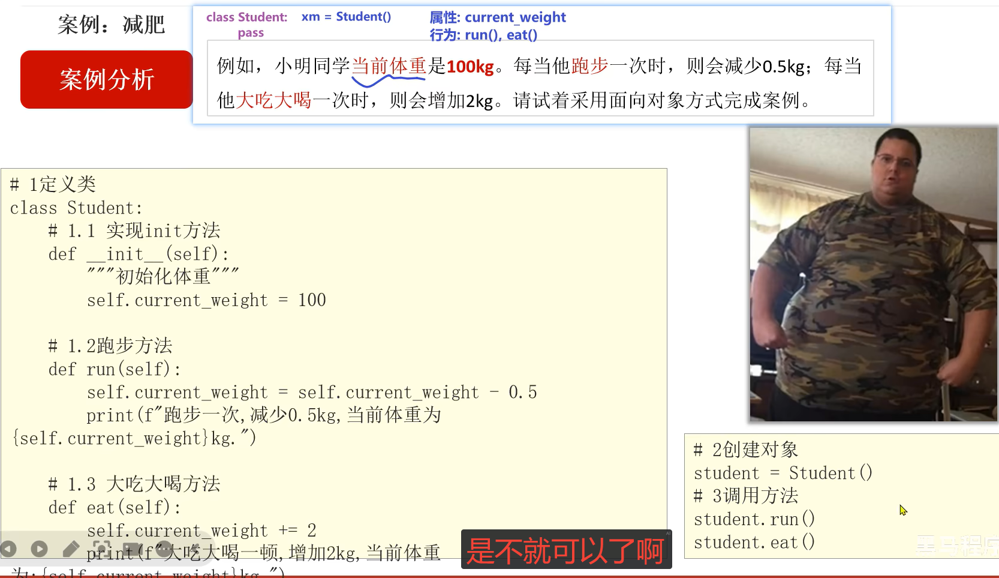

```py
"""
例如，小明同学当前体重是100kg。每当他跑步一次时，则会减少0.5kg；
每当他大吃大喝一次时，则会增加2kg。请试着采用面向对象方式完成案例。

分析:
    类名:           Student
    对象名:         xm
    属性(名词):     当前体重,current_weight
    行为(动词):     跑步,吃饭
"""
# 1.定义学生类
class Student:
    # 2.在魔法方法init中，完成：对象的属性的初始化
    def __init__(self):
        self.current_weight = 100

    # 3.每当他跑步一次时，则会减少0.5kg
    def run(self):
        print("疯狂跑步..减少0.5")
        self.current_weight-=0.5    # 体重减小

    # 4.大吃大喝
    def eat(self):
        print("大吃大喝...增加2")
        self.current_weight+=2

    # 5.重写魔法方法str,打印属性值,即:当前体重
    def __str__(self):
        # return "当前体重:%s" % self.current_weight
        return f"当前体重:{self.current_weight}kg!"

# 6.测试
# 如果未来你的这个模块要被别人调,那你是不是要把测试代码 写到main里边
if __name__ == '__main__':
    # 6.1 创建对象
    xm = Student()

    # 6.2 跑步
    xm.run()
    xm.run()
    # 6.3吃喝
    xm.eat()

    # 6.4当前体重
    print(xm)
```

### 烤地瓜案例

> 分析类
>
> 属性和行为

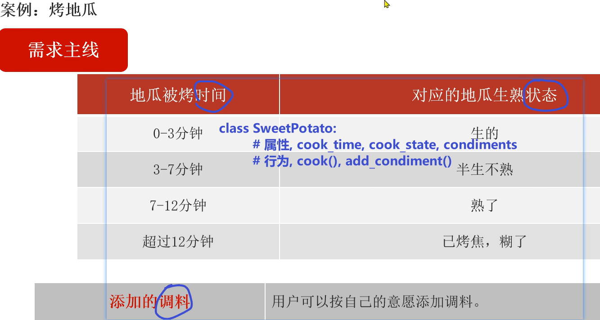


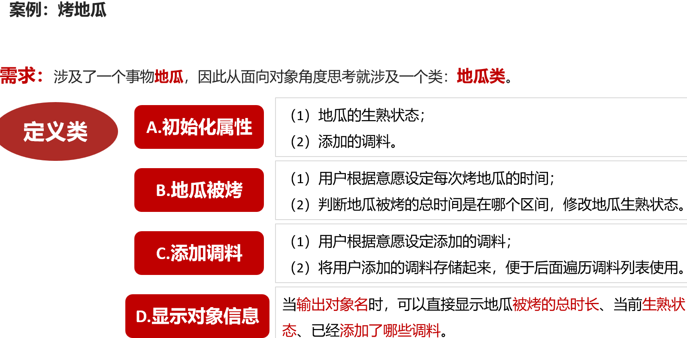


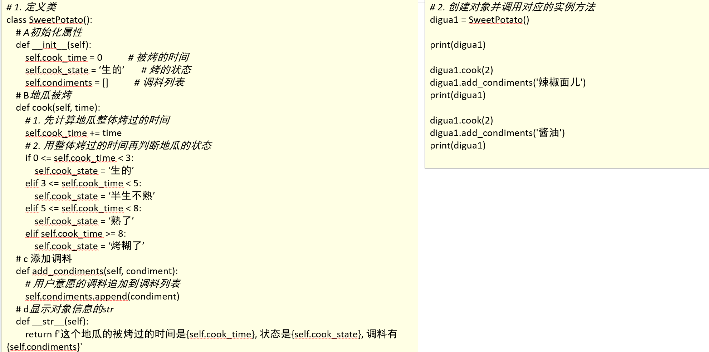


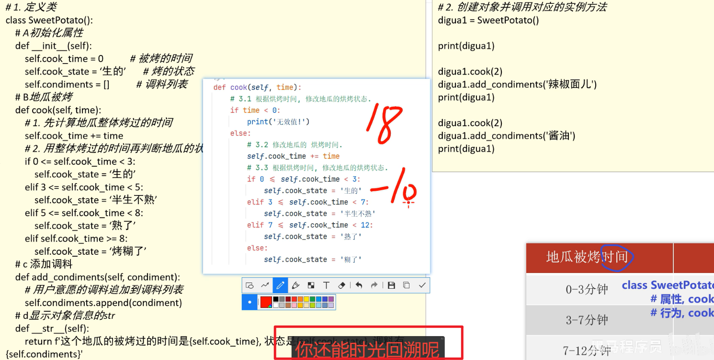

```py
"""
案例:烤地瓜

需求:
    1.定义地瓜类 -> SweetPotato
    2.属性:被烤时间cook_time,烘焙状态cook_state,调料 condiments
    3.行为:烘烤cook(),添加调料 add_condiment()
    4.魔法方法:init() -> 初始化属性, str() -> 打印地瓜信息
    5.规则:
        烘烤时间        地瓜状态
        [0,3)           生的          包左不包右,前闭后开
        [3,7)           半生不熟
        [7,12)          熟了
        [12,∞]            糊了
"""
# 1.定义地瓜类 -> SweetPotato
class SweetPotato:
    # 2.在魔法方法__init__()中,初始化地瓜的属性
    # 那如果是从别的炉子拿过来呢，有参也行吧，设置一个默认值就行
    def __init__(self):
        self.cook_time = 0
        self.cook_state = "生的"
        self.condiments = []

    # 3.具体的烘烤动作
    def cook(self,time):
        # 3.1根据烘烤时间,判断地瓜的 烘烤状态
        if time<0:
            print("无效值")
        else:
            # 3.2修改地瓜的 烘烤时间
            self.cook_time += time
            # 3.3根据烘烤时间,判断地瓜的 烘烤状态
            if 0<=self.cook_time<3:
                self.cook_state = "生的"
            elif 3<=self.cook_time<7:
                self.cook_state = "半生不熟"
            elif 7<=self.cook_time<12:
                self.cook_state = "熟了"
            else:
                self.cook_state = "糊了"
    # 4.添加调料 add_condiment()
    def add_condiment(self,condiment):
        self.condiments.append(condiment)

    # 5.重写str()方法,打印地瓜信息
    def __str__(self):
        return f"烘烤时间:{self.cook_time},烘烤状态:{self.cook_state},调料:{self.condiments}"

# 6.测试
if __name__ == '__main__':
    # 7.创建地瓜对象
    dg=SweetPotato()

    # 8.具体的烘烤动作
    # dg.cook(-3)
    dg.cook(3)
    dg.cook(5)
    dg.cook(7)

    # 9.添加调料
    dg.add_condiment("芥末/辣根")
    dg.add_condiment("鱼腥草,折耳根")
    dg.add_condiment("豆汁")
    dg.add_condiment("鲱鱼罐头")

    # 10.打印地瓜状态
    print(dg)
```


## 定义类的三种格式p19

多层继承

```py
# 第一种(常用)
class 类名：
	pass
# 第二种
class 类名():
    pass
# 第三种(常用)
class 类名(父类名):
	pass
```


> 定义成私有方法就不会被继承了?
>
> 定义成私有也会继承下来，只能被名称修饰了，你调错了。


## 继承入门p20、单继承p21


> 父类的私有属性和私有方法是不能继承的?
>
> 可以继承，Python中的私有是约定式的


## 多继承p22

>  从左往右就近原则


当一个类有多个父类时，默认使用**第一个父类**的**同名属性和方法**

## 多继承中的继承顺序p23

> 扩展mro机制


> 查看(类的)引用顺序的两种途径,注意是:
>
> **类名**.属性名		# Prentice.\__mro__
>
> **类名**.方法名()	     # Prentice.mro()
>
> 注意是类名点出来的,不是对象名!!

```py
class Master:
    def __init__(self):
        self.kongfu= '古法配方'

    def make_cake(self):
        print(f"运用{self.kongfu}制作煎饼果子")

class School:
    def __init__(self):
        self.kongfu="黑马配方"

    def make_cake(self):
        print(f"运用{self.kongfu}制作煎饼果子")

class Prentice(School,Master):
    pass

xm=Prentice()
# print(xm.kongfu)    # 访问属性：对象名.属性名
xm.make_cake()          # 运用黑马配方制作煎饼果子

class Master:
    def __init__(self):
        self.kongfu= '古法配方'

    def make_cake(self):
        print(f"运用{self.kongfu}制作煎饼果子")

class School:
    def __init__(self):
        self.kongfu="黑马配方"

    def make_cake(self):
        print(f"运用{self.kongfu}制作煎饼果子")

class Prentice(School,Master):
    pass

xm=Prentice()
# print(xm.kongfu)    # 访问属性：对象名.属性名
xm.make_cake()          # 运用黑马配方制作煎饼果子

print(Prentice.__mro__) # (<class '__main__.Prentice'>, <class '__main__.School'>, <class '__main__.Master'>, <class 'object'>)
print(Prentice.mro())   # (<class '__main__.Prentice'>, <class '__main__.School'>, <class '__main__.Master'>, <class 'object'>)

```

> 徒弟类里没有konhfu和makecake，使用的话遵循就近原则


## 子类重写父类功能(第二章p1)


> 和java不一样,java不能重写属性,python可以重写属性


> self指的是对象，而调用的master方法，里面的self调到徒弟里面去了归徒弟管，所以要调父类的话,要构造方法把值改了，改成master的值


> 使用变量遵循就近原则，我自个类有，就拿来用，没有的话找近的父类，近的父类没有就往下继续找


>  那老师为啥报警告?
>
> 原因是因为:他告诉你,在父类中已经有对应的属性了,你的子类是不是还要去做这个事情啊,那就有点多此一举
>
> 警告归警告,但是执行依然没报错


## 子类访问父类成员_方式1(p2)

> 1. 父类名.父类方法名(self)	# 精准访问，想找哪个父类，就调哪个父类


> 因为self本类当前对象的引用还是Prentice的init里的所以这里打印的是独创煎饼果子


> 就看self是谁，因为已经执行了一次init换成了master属性了

self像指针，按指针理解简简单单

其实就是 如果不加 Master.\__init__(self)， 用的就是子类自己的 init,

> self一直没变过,只不过是调用了父类的方法,**父类的属性覆盖了自己的属性**


>  说的那么复杂，直接说**父类的初始值覆盖掉子类的初始值**就好了


## 子类访问父类成员_方式2(p3)

```py
# 思路:
#    1.父类名.父类函数名(self)   精准访问，想找哪个父类，就调哪个父类.
#    2.super().父类函数名()    只能访问最近的那个父类，有就用，没有就往后继续查找
```

>  2.super().父类方法名()     # 只能访问最近的那个父类，没有就往后一直找方法


>  我就想通过super小括号的方式,直接访问第二个或者第三个父类的成员,这个能不能做到?
>
> 做不到!
>
> super()它只能从前往后去初始化,前面没有才会往后找,前面有的情况下,不会找master


## 多层继承p4


> self是本类当前对象的引用
>
> super代表父类


## 封装


### 定义和获取私有属性


```py
class Master:
    def __init__(self):
        self.kongfu="古法配方"

    def make_cake(self):
        print(f"使用{self.kongfu}制作煎饼果子")


class School:
    def __init__(self):
        self.kongfu="黑马配方"

    def make_cake(self):
        print(f"运用{self.kongfu}制作煎饼果子")


class Prentice(School,Master):
    def __init__(self):
        self.kongfu="独创配方"
        self.__money=20000

    def make_cake(self):
        print(f"使用{self.kongfu}制作煎饼果子")

    def get_money(self):
        return self.__money

    def set_money(self,money):
        self.__money = money

class Tusun(Prentice):
    pass

ts=Tusun()
# print(ts.__money)       # 报错
print(ts.get_money())       # 获取私有属性 20000
ts.set_money(100)           # 设置私有属性
print(ts.get_money())       # 获取更新后的私有属性 100
```

> **在类内写获取属性,设置属性值的**(留给外面访问的)**接口** 
>
> get_属性值(名)
>
> **在类内，私有属性和私有方法想怎么用就怎么用**


```py
class Master:
    def __init__(self):
        self.kongfu="古法配方"

    def make_cake(self):
        print(f"使用{self.kongfu}制作煎饼果子")


class School:
    def __init__(self):
        self.kongfu="黑马配方"

    def make_cake(self):
        print(f"运用{self.kongfu}制作煎饼果子")


class Prentice(School,Master):
    def __init__(self):
        self.kongfu="独创配方"

    # 定义私有方法
    def __make_cake(self):
        print(f"使用{self.kongfu}制作煎饼果子")

    def make(self):     # 类内,访问私有方法的接口
        self.__make_cake()

class Tusun(Prentice):
    pass

ts=Tusun()
ts.make()   # 使用独创配方制作煎饼果子
```


## 多态

### 定义

> 同样的函数,传入不同的对象,得到不同的状态


> 你这car是自己写了个speak方法，执行外面函数不就还是Car().speak调用的嘛，两个完全没有关系的东西怎么多态？也就是说你的Car类既没有重写、继承，又没有指向，就是个普通类，哪来的继承？
>
> 类型注解


> 这句话的意思就是你将来调我这个函数，你必须是我animal的子类

我感觉是python没有变量定义造成的。

> Python做不到真正意义上的多态


> 这个地方的多态,他无法精准地限定类型


> java抽象类要全部实现


> Python里子类对于父类的抽象方法不需要全部实现

继承 重写 **父类引用指向子类对象**


### 属性、类属性、类方法、静态方法


> 如果要修改**类变量**的值，只能通过 **类名.** 的方式实现

> 对象属性，他的访问和设置都只能通过 对象名点
> 但是类属性如果你要访问，对象名点也行，类名点也行，但是你想修改只能通过类名点

> 定义到函数外，但是在类中的叫类属性
>
> 写到init里面的叫对象属性


### 类方法,静态方法

> 1.类方法,就是属于类本身,不属于某个对象的方法,不用创建对象,直接用类就能调用
>
> 2.类方法,操作类属性,不操作实例.类属性是所有对象共享的,类方法可以安全修改,读取这类的全局属性


> 类方法要求第一个参数必须是类对象

类方法可以访问类属性，不能访问实例属性；而静态方法两个属性都不能访问

类方法和静态方法的区别只在于访问类属性时，类方法简便一点cls.类属性，而静态方法复杂一点，要类名.类属性

区别就只在于第一个参数表示类对象

静态方法常用，用类名点类属性就能用了

【当然有区别，这两种方法不能直接访问和修改实例属性，他们访问的是类的属性

> self是表示对象的引用，指向实例对象，cls表示类的引用，指向类


如果要往静态方法加定义参数，也是可以的


## 学生管理系统

> 名词提取法,提取名词作为类
>
> CMS(Content Management System)

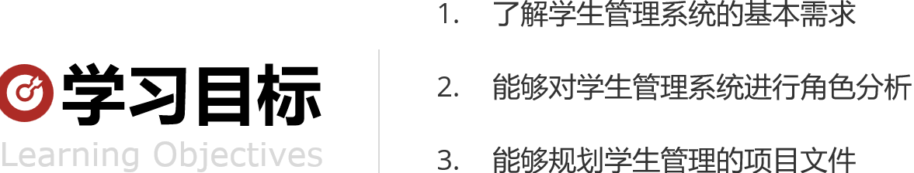


> 3个py文件

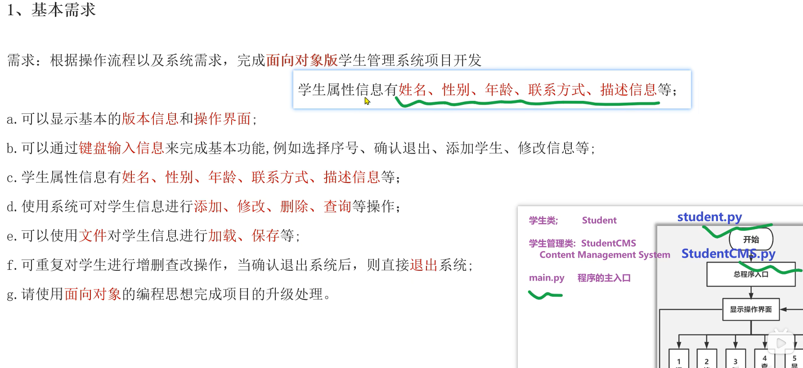

> 


> 


> 


> 学生管理系统面向对象版思路分析

### 学生管理系统实践

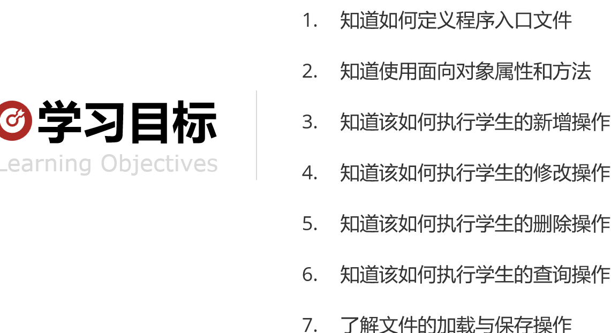

> 

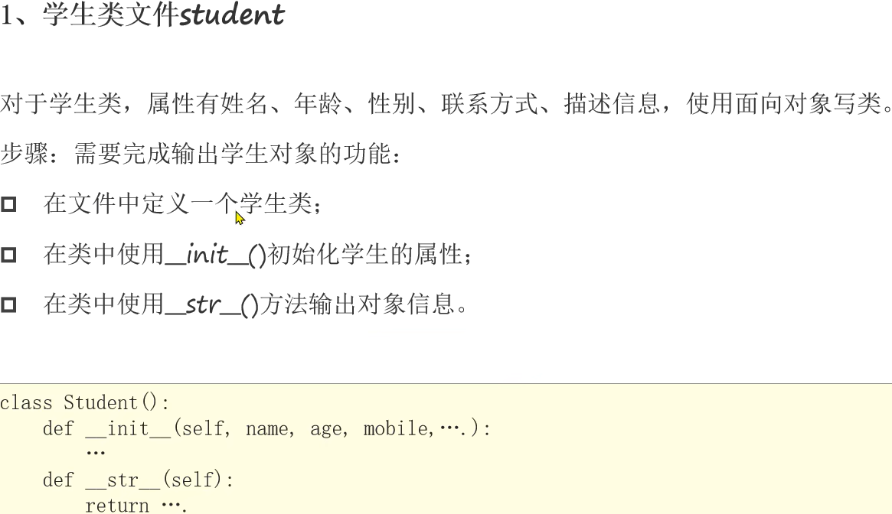

```py
"""
该文件用于记录 学生类,学生的属性信息为:姓名,性别,年龄,手机号,描述信息

"""
# 1.定义学生类.
class Student:
    # 2.定义魔法方法,初始化属性信息
    def __init__(self,name,gender,age,phone,desc):  # describe = desc描述信息
        """
        该魔法方法,用于初始化 属性信息
        :param name:        学生姓名
        :param gender:      性别
        :param age:         年龄
        :param phone:       手机号
        :param desc:        描述信息
        """
        self.name= name
        self.gender = gender
        self.age = age
        self.phone = phone
        self.desc = desc

    # 如果未来我想快速的打印这个对象的信息,还需要__str__
    # 3.定义魔法方法,用于打印学生信息
    def __str__(self):
        """
        该魔法方法,用于打印学生信息
        :return:
        """
        return f"姓名: {self.name},性别: {self.gender},年龄: {self.age},手机号: {self.phone},描述信息: {self.desc}"

# 4.测试(手机号不需要涉及到算数运算,所以就用字符串类型)
# 在调用者中,不执行被调用者的测试代码
if __name__ == '__main__':
    s=Student('乔峰','男',18,'13112345678','丐帮帮主')
    print(s)
```


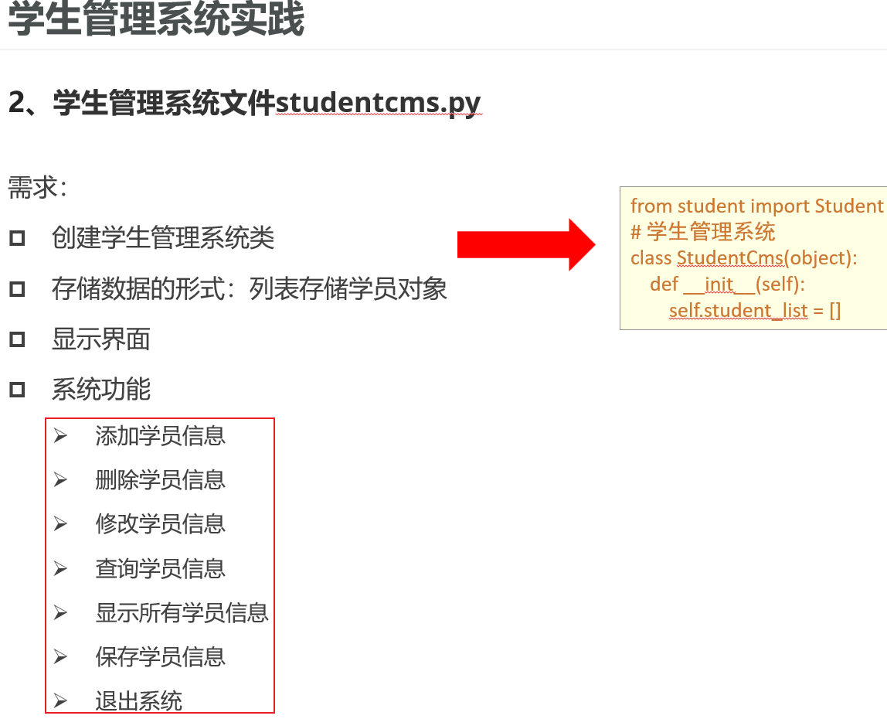

> 有个属性记录学生列表

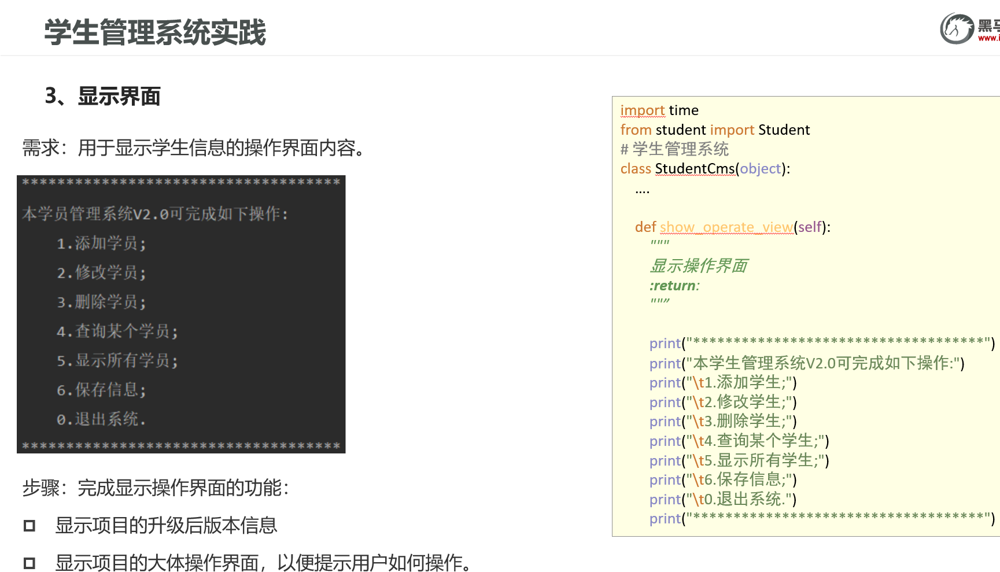


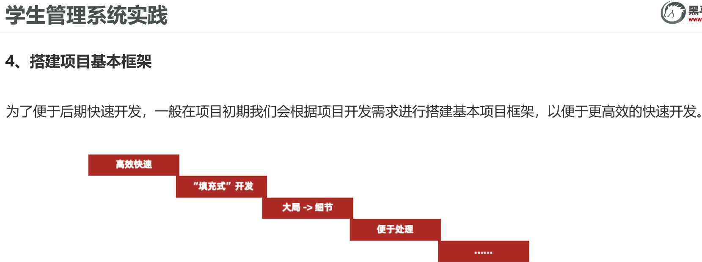


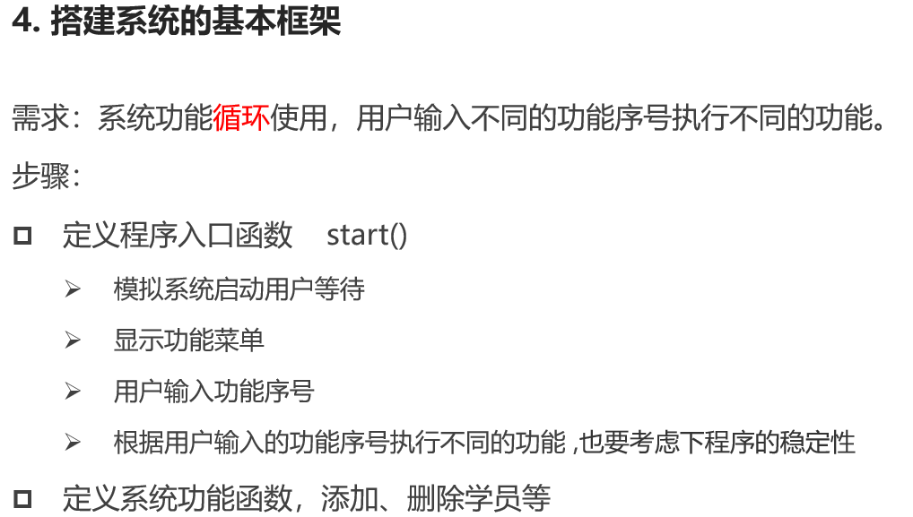


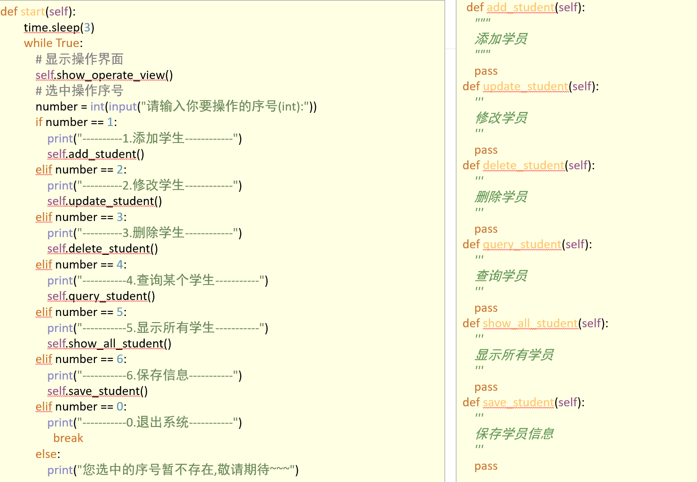


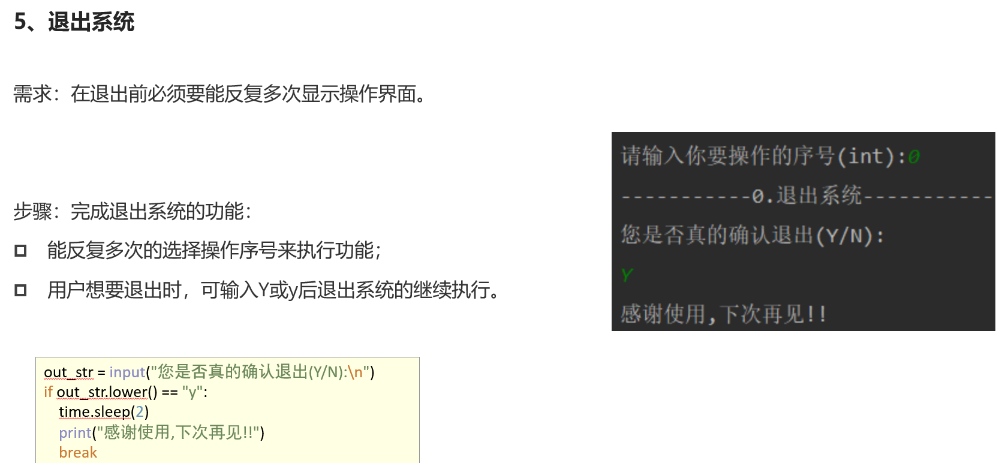


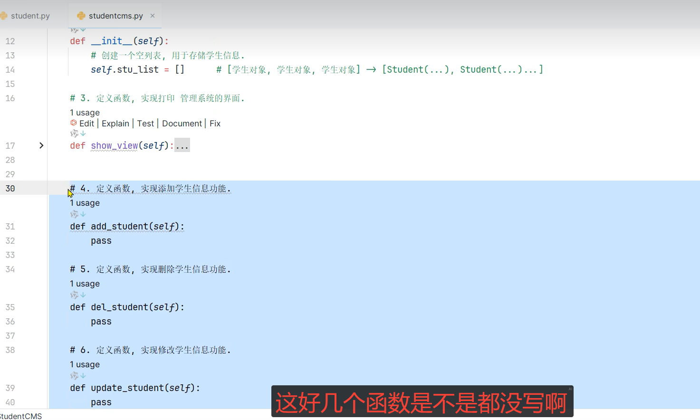

> 接下来把这好几个函数补齐就行了
>
> 那我刚才做的这个事，在公司中一般就是公司的架构师（项目经理），就是把整个项目的架构快速搭起来，然后就由程序员往里边摞代码

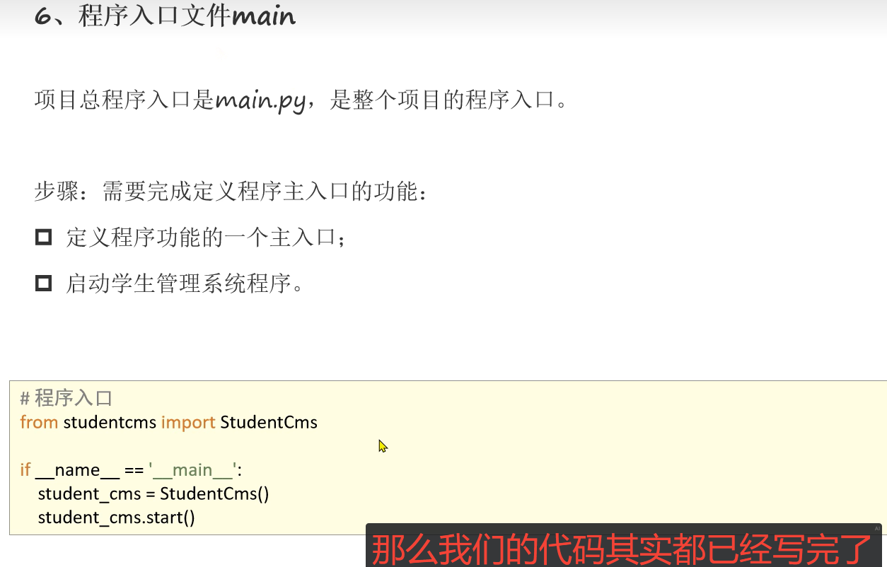

> 我们应该把你的测试代码,是不是应该放到另外一个文件,叫做main.py才合适


==原来如此==

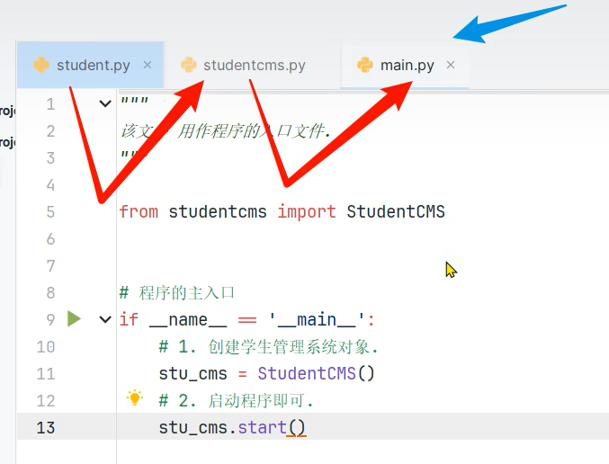

> 你看你的学生这个对象,将来在管理里边被访问,管理里边他写的功能将来在主入口里边去访问,对于外界的用户来讲,他将来干的事情就是直接去访问你的main文件,那这样的话是不是作为程序的入口,去调你的管理文件,去调你的学生对象
>
> 所以呢我们将来的代码要写到main里边

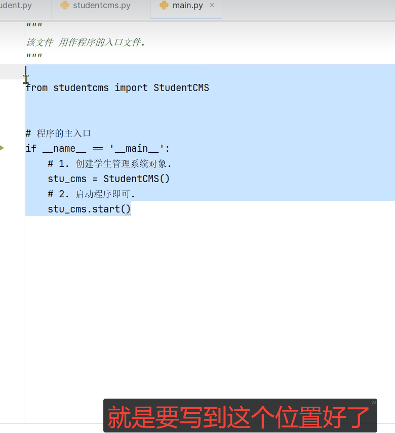

> 虽然main文件的流程和刚刚每个子模块的测试代码差不多相同,但是在实际开发中,你要单独的把它写到一个文件中才可以

学生管理系统_入口文件

如下的代码是写到**main.py**文件中的

```py
"""
该文件 用作程序的入口文件.
"""
from studentcms import StudentCMS

# 程序的主入口
if __name__ == '__main__':
    # 1.创建学生管理系统对象
    stu_cms=StudentCMS()
    # 2.启动程序即可
    stu_cms.start()
```


### 13.学生管理系统_功能实现

* 添加学生

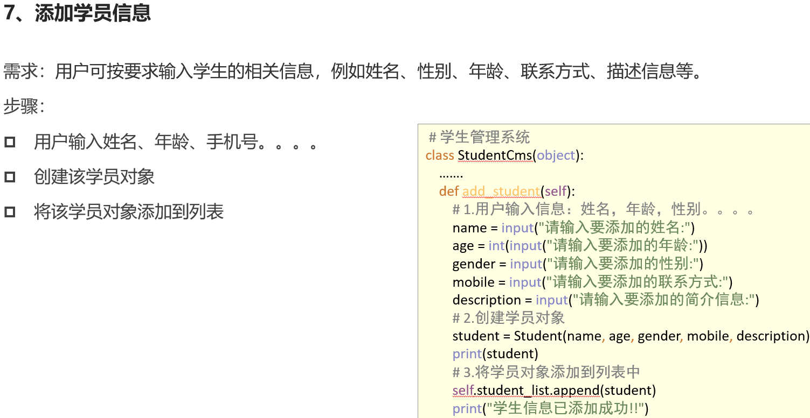


让用户录入信息，我们接收封装往里边塞，就可以了

```py
# 4.定义函数,实现添加学生信息功能
def add_student(self):
    # 4.1提示用户输入学生信息,并接收
    name = input("请输入学生姓名:")
    gender = input("请输入学生性别:")
    age = int(input("请输入学生年龄:"))    # 学生年龄是一个整数
    phone = input("请输入学生手机号:")
    desc=input("请输入学生描述信息:")
    # 4.2把上述的信息封装成学生对象
    stu=Student(name,gender,age,phone,desc)
    # 4.3学生对象添加到列表中
    self.stu_list.append(stu)
    # 4.4提示
    print(f'添加{name}学生信息成功!\n')
```

* 查看所有学生信息

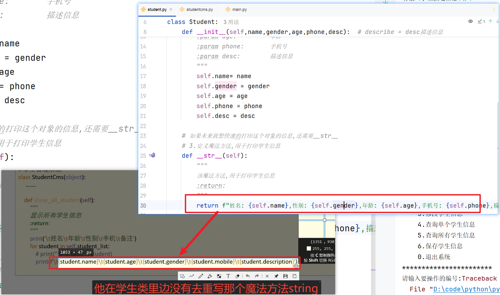

> 重写__str__,就可以直接打印,打印类对象就打印了我们重写好的那一堆类对象的属性

```py
# 8.定义函数,实现查询所有学生信息功能
def search_all_student(self):
    # 8.1判断列表长度是否为0，如果为0,提示用户暂无学生信息，请添加后查询
    if len(self.stu_list)==0:
        print("暂无学生信息，请添加后查询\n")
    else:
        # 8.2如果长度不为0 遍历列表，打印出所有的学生信息
        for stu in self.stu_list:
            print(stu)
        print()     # 为了格式好看,在星星行上面加一行空行
```

* 删除学生的信息

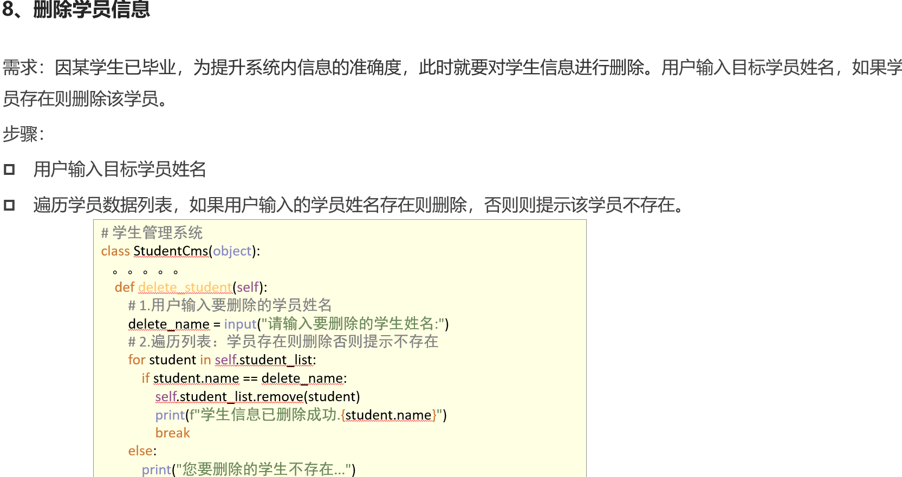

```py
# 5. 定义函数,实现删除学生信息功能
def del_student(self):
    # 5.1提示用户输入要删除的学生的姓名,并接收
    del_name = input("请输入要删除的学生姓名:")
    # 5.2遍历列表,找到要删除的学生
    for stu in self.stu_list[:]:
        # 5.3如果当前的学生的姓名 和 要删除的学生相同,则删除该学生
        if del_name == stu.name:
            self.stu_list.remove(stu)
            print(f"学员{del_name} 删除成功!\n")
            break
    else:
        # 走到这里,说明没有走break,即:没有找到这个学生
        print(f"没有找到学员{del_name},请检查后重新删除!\n")
```


### 14.修改学生信息

```py
# 6. 定义函数,实现修改学生信息功能
    def update_student(self):
        # 6.1提示用户输入要修改的学生的姓名,并接收
        upd_name = input("请输入要修改的学生姓名:")
        # 6.2遍历列表,找到要修改的学生,并修改
        for stu in self.stu_list[:]:
            # 6.3如果当前的学生的姓名 和 要修改的学生相同,则修改该学生
            if upd_name == stu.name:
                # 6.4提示用户录入该学员新的信息
                stu.gender=input("请录入修改后的性别:")
                stu.age=int(input("请录入修改后的年龄:"))
                stu.phone=input("请录入修改后的手机号:")
                stu.desc=input("请录入修改后的描述信息:")

                print(f"学员 {upd_name} 修改成功!\n")
                break
        else:
            # 走到这里,说明没有走break,即:没有找到这个学生
            print(f"没有找到学员{upd_name},请检查后重新修改!\n")
```


### 15.查询单个学生信息

```py
# 7.定义函数,实现查询单个学生信息功能
    def search_one_student(self):
        # 7.1提示用户输入要查找的学生的姓名,并接收
        search_name = input("请输入要查找的学生姓名:")
        # 7.2遍历列表,找到要查找的学生,并打印出该学生信息
        for stu in self.stu_list[:]:
            # 7.3如果当前的学生的姓名 和 要查找的学生相同,则查找该学生(其实就打印)
            if search_name == stu.name:
                print(stu,end='\n\n')
                break
        else:
            # 走到这里,说明没有走break,即:没有找到这个学生
            print(f"没有找到学员{search_name},请检查后重新查找!\n")
```

### 16.扩展\__dict__

> 往文件里写学生信息还好写,但一会你从文件里边是不是还得能读出来才可以啊,
>
> 所以说扩展一个内容,\__dict__

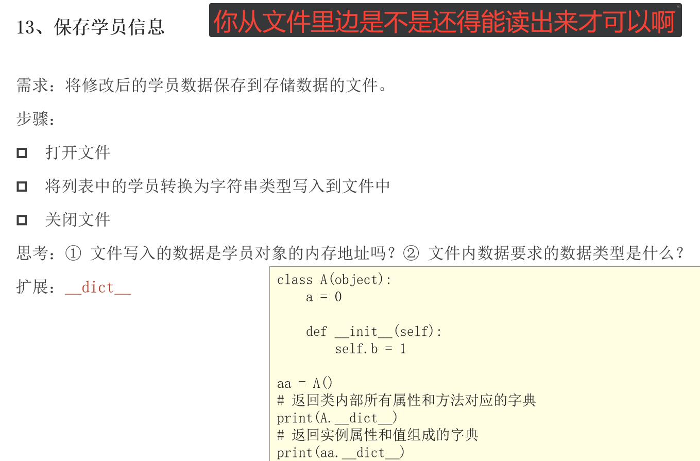

```py
class A(object):
    a=0
    def __init__(self):
        self.b=1
aa=A()
# 返回类内 所有属性和方法对应的字典
print(A.__dict__)
# {'__module__': '__main__',
# 'a': 0,
# '__init__': <function A.__init__ at 0x000001D08CD745E0>,
# '__dict__': <attribute '__dict__' of 'A' objects>,
# '__weakref__': <attribute '__weakref__' of 'A' objects>,
# '__doc__': None}

# 返回实例 属性和值组成的字典
print(aa.__dict__)
# {'b': 1}
```

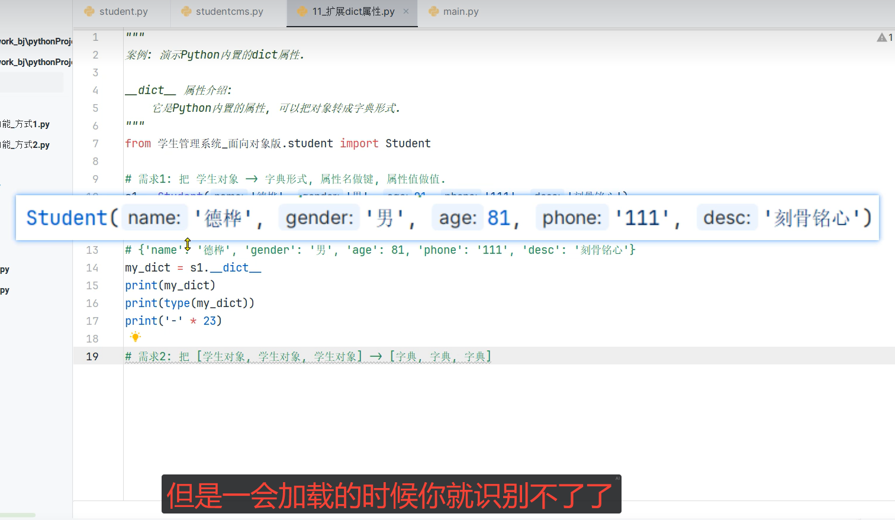

> 可以把这玩意往文件里写,但是一会加载的时候你就识别不了了,因为我们一会读出来的数据,还是要转成信息
>
> 读的时候,把字典转成对象


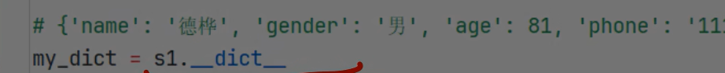

> 如果是学生对象转字典,调dict这个属性

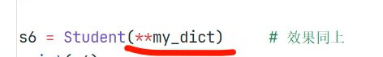

>  如果是你的字典转学生对象,**字典就行了


### 17.保存学生信息

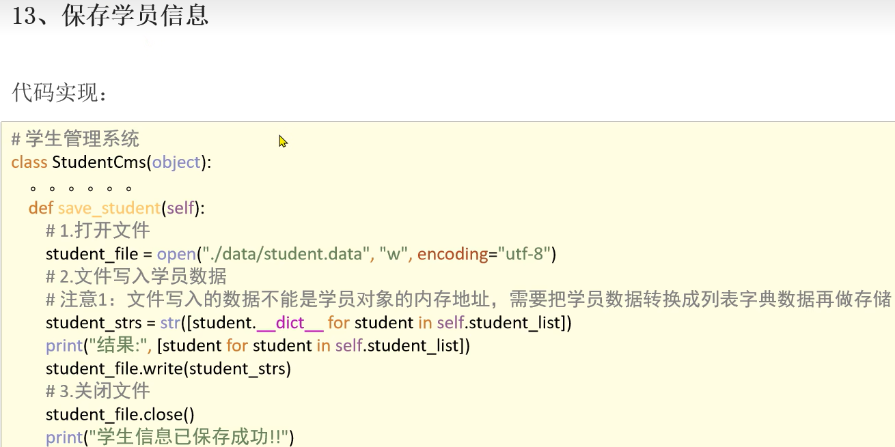

```py
# 9.定义函数,实现保存学生信息功能
def save_student(self):
    # 关联 学生信息文件
    # ./代表的是项目的路径,它可不是你在的路径
    with open('./stu_data.txt','w',encoding='utf-8') as dest_f:
        # 9.2 把 列表套对象 转成 列表套字典
        # 9.2 把 [学生对象,学生对象.学生对象] -> [字典,字典,字典]
        stu_dict=[stu.__dict__ for stu in self.stu_list]
        # 9.3把字典列表,持久化到文件中.
        dest_f.write(str(stu_dict)) # 记得把字典转成字符串再写入
```


### 18.加载学生信息

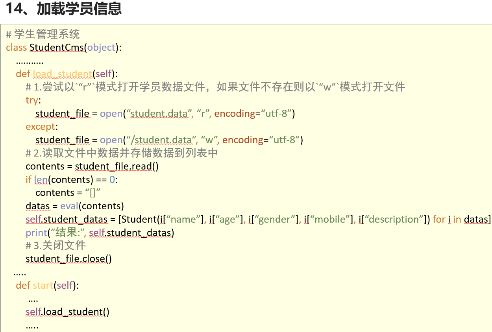

```py
# 10.定义函数,实现加载学生信息
    def load_student(self):
        # 10.1
        # 10.2 关联学生信息文件
        with open('./stu_data.txt','r',encoding='utf-8') as src_f:
            # 10.3一次性读取所有的数据
            stu_data=src_f.read()       # '[字典,字典...]' 字符串形式下的列表套字典
            # 10.4把上述的字符串,转换为列表套字典
            stu_list=eval(stu_data)     # ''
            # 10.5判断如果列表为空,就赋予空列表
            if len(stu_list)==0:
                stu_list=[]
            # 10.6走到这里说明列表不为空,则把stu_list(列表套字典),转成 [学生对象,学生对象,学生对象],并赋值给self.stu_list
            self.stu_list=[Student(**stu_dict) for stu_dict in stu_list]
```


> 少写一个 self，多写一串 @staticmethod......

> 字典:
> {=="变量名"==`:`=="变量值"==}


## 闭包

> 不改变函数代码对功能做增强


> 浅拷贝拷贝的少,深拷贝拷贝的多


注意单独加法和累加的区别


> 使用外部函数变量的内部函数,叫做闭包


> 1.有嵌套
>
> 2.有引用
>
> 3.有返回


> 外部函数的变量包括: 外部函数的 形参 和 局参


> 看到这个尖括号,要弄清楚: **函数名** 和 **函数名括号**是两个概念,前者表示 **函数对象**,后者表示 **调用函数获取的返回值**


> 函数名可以赋值给变量,这个变量就是:函数对象


> 就是返回函数对象被呗，然后内部函数捕获了外部函数变量，最后当外部函数终止的时候，内部函数依旧可以使用外部函数变量
>
> 把内部函数当做对象，作为外部函数的返回值进行返回


> 前面的不能这么理解，内层返回的是对象，而不是内层函数，而是你在调用外部函数时，拿到了内部函数，刚好可以配对上


> 没改变num1
>
> 相当于是把内层 函数对象返回了给fn_inner然后在接收num2然后输出加和结果


### 闭包入门图解


### nonlocal关键字

不是全局哦,相当于在函数内部的全局


> 调用完外部函数a不是已经没了吗，为啥还能输出a = 100 ?
>
> 内部函数中引用了a变量,fn_inner=fn_outer()时就已经给了内部函数a的值,再调用内部函数就可以用a了
>
> 内部函数使用了外部函数的变量，这就叫做有引用


> 你会发现你改的不是外部函数的a，而是去重新声明了一个101

> 闭包只是让你去获取外部函数的变量，没让你去改，而nonlocal就是让你可以在闭包里改外部的变量
>
> 但是弹栈后还能访问外部函数变量，但是不能修改了
>
> nonlocal 是函数内部的全局，小全局
>
> 就算是做嵌套，但是在实际中大部分也是在类里面操作吧
>
> 因为使用nonelocal声明了a为非局部变量，那么在整个程序执行完之前，a没有被销毁，所以a的值会一直累加，直到整个程序完全执行完毕


有点像lamda表达式，当时在学Java函数式编程就是把方法包一个对象提供返回这个方法

> 调用的名字怎么起得和内部函数一样？应该换一个观感好点
>
> 他是为了给后面装饰器作铺垫，变量名仍然使用内部函数的


你调外部函数的主观目的实际上就是为了调内部函数


> 你能用，但是你不能改

这里并不是内部函数里不能修改外部变量，而是内部函数把a=a+1视作内部变量a代替了外部变量a，而内部变量a没有值，当然a=a+1不成立

既然内部都可以打印a了，为什么说内部变量a没有值？


> nonlocal其实就是声明该变量不是我们内部定义的，是其他地方来的
>
> 老师说的是对的，就是内部变量没有提前定义，操作不了
>
> 就是告诉python，当前的a是 外部函数的变量，而不是当前内部函数的还未定义的变量‘


```py
# 闭包入门.py     			(延长 外部函数局部变量 的生命周期)
# 1.定义外部函数
def fn_outer(num1):
    # 2.定义内部函数
    def fn_inner(num2):     # 有嵌套
        # 3.求和
        sum=num1+num2       # 有引用
        print(f"求和结果：{sum}")
    return fn_inner         # 有返回

# 4.调用上述函数
fn_inner=fn_outer(10)
fn_inner(1)     # 11
fn_inner(1)     # 11
fn_inner(1)     # 11
```


```py
# 在闭包里nonlocal			(修改 外部函数局部变量 的值)
def fn_outer():
    a=100
    def fn_inner():
        nonlocal a
        a=a+1
        print(f"a:{a}")

    return fn_inner

if __name__ == '__main__':
    fn_inner=fn_outer()
    fn_inner()  # 101
    fn_inner()  # 102
    fn_inner()  # 103
```


> 闭包真正的应用场景:装饰器


## 装饰器

> 语法糖(语法格式的简化版)方式用的更多!


```bash
#  闭包(1.有嵌套2.有引用3.有返回) + 4.有额外功能 = 装饰器
```

> 装饰器的本质:在不改变原有函数功能的基础上,对原有函数的功能做升级!
>
> 一个毛胚房,找个装修队(装饰器)过来,田园风,现代风...
>
> 不改变功能的基础上,对功能做增强(一定要加功能,否则就是闭包)

闭包是私有化全局变量！！！


> 其实就是通过外部方法获取到内部方法对象，但是外部要传一个需要被增强的方法作为参数给内部方法去调用，但是内部调用之前对原方法做了增强，就这么简单，感觉讲的好绕啊，绕了半天


> 感觉就是写了个新函数，然后新函数调用原函数进行增强。
>
> 对 所以叫做语法糖 就是一种语法的运用
>
> 其实你把试学班学的内容就是全部python了 剩下现在教的就全是语法糖了

### 方式2：语法糖


```py
"""
装饰器介绍：
    概述/作用：
        它的本质是1 个闭包函数，目的是 在不改变原有函数的基础上，对其功能做增强
        大白话： 装修队 在不改变房屋结构的情况下，对房屋做装饰(功能增强)
    前提条件:
        1.有嵌套
        2.有引用
        3.有返回
        4.有额外功能
    装饰器的用法:
        格式1:传统写法
            装饰后的函数名=装饰器名(被装饰的原函数名)
            装饰后的函数名()

        格式2:语法糖
            在要被装饰的原函数上,直接写 @装饰器名,之后直接调用原函数即可
"""
# 在发表评论前,都需要登录

# 1.定义外部函数,形参列表接收 要被装饰的函数名(对象)
def check_login(fn_name):       # fn_name: 要被装饰的函数名(对象)
    # 1.1 定义内部函数
    def fn_inner():             # 有嵌套
        # 1.2 额外功能
        print("校验登录..登陆成功!")        # 这个是 额外功能
        # 1.3 访问原函数 ,即:外部函数的引用
        fn_name()               # 有引用
    # 1.4 返回内部函数对象
    return fn_inner             # 有返回

# 2.定义函数,表示 发表评论
def comment():
    print("发表评论")


@check_login        # 底层其实是: payment=check_login(payment)
def payment():
    print("充值中...")

# 3.测试
# 3.1 传统方式
hg=check_login(comment)
hg()            # 没诉求
print('-'*32)
comment()       # 有诉求用之前的原函数
print('-'*32)

# 3.2语法糖
# payment=check_login(payment)
# payment()
payment()
```


### 装饰器的使用

三层装饰器其实就是给装饰器传参


> ```py
> # 装饰器的内部函数格式 要和 被装饰的原函数 保持一致
> ```


### 有参数无返回


>  我认为： getsum 函数地址指向inner 换句话说这两个就是一个函数 所以都有参数


>  有了闭包后，即使外部函数执行完毕，内部函数依旧可以使用外部函数的变量.
>
> 装饰器:闭包的一种写法


### 无参有返回

装饰器的内部函数格式 要和 被装饰的原函数格式 一致


### 有参有返回


### 可变参


> 其实这里的传参可以这样来理解：fn_inner把外来的参数先进行打包，然后在内部函数引用fn_name时进行解包，然后调用fn_name时又打包起来进行后续计算


### 多个装饰器装饰一个原函数

> 由内向外去装饰


> 这里我懂了，这里comment第一次被修饰就是验证码，第二次被修饰就是加一个校验登录，变量名一直是comment，指向的已经变了

> 很简单因为是一层一层返回，使用@属于是做设计符合使用习惯


### 一个装饰器装饰多个原函数

带有参数的装饰器


> 别人调你装饰器就只能使用固定的名字了，当然一般也不自己设置装饰器


## 深浅拷贝

==普通赋值就是不拷贝,不拷贝就是不变地址==

==拷贝就是变地址==

> ```py
> # 深浅拷贝主要是针对于可变类型来讲的, 深拷贝拷贝所有层(可变), 浅拷贝只拷贝第1层(可变)
> #    如果是针对于不可变类型, 则用法和 普通赋值一样, 并无区别.
> ```

> 可变(列表,集合,字典)与不可变(元组,字符串,数值类型)类型:
>
> **在不改变地址值的情况下,他里边的内容能不能改**
>
> 不可变类型：同样的数据在内存地址是相同的(只有一个)


> 创建变量a,创建一个对象,分配一块空间,把这块空间的地址给到a


```py
# a=10
# b=a
# c=10
# 问：内存中有几个10？
Python 在内存中创建一个整数对象 10
变量 a 指向这个对象
# Python 对 -5 ~ 256 之间的小整数做了全局缓存：
# 这些数字使用频率极高
# 系统提前创建好，重复使用，不重复开辟内存
# 总结
# a=10 → 内存创建 1 个 10
# b=a → 复用同一个 10
# c=10 → 还是复用同一个 10
# 最终答案：内存里只有 1 个 10。
```

> c语言的变量是地址的别名，而python是对象的引用

### 普通赋值，不可变类型（普通拷贝就是不拷贝，不复制，跟着变）


### 普通赋值，可变类型（普通拷贝就是不拷贝，不复制，第一层地址不变）


### 浅拷贝可变类型（浅拷贝，就是拷贝第一层，复制第一层，第一层地址变）

浅拷贝操作可变类型，可变元素变了，浅拷贝里的可变元素就跟着变


### 浅拷贝不可变类型(不可变浅拷贝,就是不拷贝，不复制，第一层地址不变）

> 如果是不可变类型，和普通赋值一样，都是直接指向就可以了，因为不可变，你不可变，就意味着我没法去复制你开辟空间，那大家就必须得用同一份
>
> **不可变** 意味着没法开辟空间


### 深拷贝可变类型(可变深拷贝,就是全拷贝,全复制,所有层地址都变)


### 深拷贝不可变类型(不可变深拷贝,就是不拷贝,不复制,地址值不变)

==只要有(可变的)层,就拷贝,就复制,地址值就变==


> 可变不共享地址值变，不可变共享地址值不变


## 网络编程,进程,线程


### 网络编程

就是用来实现网络互联的 不同计算机上 运行的程序间 可以进行数据交互


三要素

IP地址:设备在网络中的唯一标识


端口号:程序在设备中的唯一标识


协议:传输规则


> 电脑上的每一个软件的端口号是唯一的

> 协议:就像你快递黄金对黄金进行包裹,加密


> IPV4采用的是4字节,十进制
>
> 每个单位,一个byte的范围有符号:-128~127
>
> ​		     无符号:0 ~ 255
>
> IPV4全球IP总数,256的4次方(不够用)
>
> IPV6八字节16进制


>  每个软件都有自己的端口


> 0~1023端口号被系统占用了,不要用


#### TCP

TCP：打电话

客户端向服务器端

服务器端给回值

客户端再找服务器端

UDP：群聊

只管发，不管接收，每个包64kb


双向，每个两次


> 谈到缺点就说 **相对**较低,优点是高,就说高

> 区分拨号方


### Socket套接字


> 客户端的手机和服务器端的手机,数据通过两个手机进行传输


字节流,TCP协议


```py
"""
网络编程介绍:
    概述:
        网络编程也叫网络通信,Socket通信,即:通信双方都独有自己的Socket对象,
        数据在Socket之间通过 数据报包(UDP协议) 或者 字节流(TCP协议) 的形式进行传输
    大白话举例:
        你和你遥远的朋友在聊天,看看这你们两个人在交互，其实是通过 两部手机(双方各自的手机)来交互的.
"""
import socket

# 创建socket对象
# 参1:Address Family,地址族,即:IPV4 还是 IPV6,默认值: AF_INET(ipv4)   AF_INET6(ipv6)
# 参2:Socket Type,套接字类型,即:TCP 还是 UDP,默认值: SOCK_STREAM(TCP)   SOCK_DGRAM(UDP)
socket_obj=socket.socket(socket.AF_INET,socket.SOCK_STREAM)
print(socket_obj)
```


### TCP程序开发流程


### 一句话交情

#### 服务器端代码


> 加个b的意思是把这个字符串转成二进制,针对于没有中文的字符串

```py
"""
网编入门案例,服务器端给客户端发送消息,客户端给出回执信息

服务器端开发流程:
    1. 创建服务器端Socket对象
    2. 绑定IP地址和端口号
    3. 设置最大监听数
    4. 等待客户端申请建立连接
    5. 给客户端发送消息
    6. 接收客户端的信息并打印
    7. 释放资源

细节:
    客户端和服务器端是通过 字节流(bytes) 的形式实现的
"""
import socket

from IPython.terminal.shortcuts.auto_suggest import accept

# 1. 创建服务器端Socket对象,ipv4,字节流(TCP)
server_socket=socket.socket(socket.AF_INET,socket.SOCK_STREAM)
# 2. 绑定IP地址和端口号
server_socket.bind(('127.0.0.1',10086))
# 3. 设置最大监听数
server_socket.listen(5)
# 4. 等待客户端申请建立连接
print(1)
accept_socket,client_info=server_socket.accept()
print(2)
# 5. 给客户端发送消息
accept_socket.send(b'Welcome To Socket!')
# 6. 接收客户端的信息并打印 (单位字节,单次会话上限)
data=accept_socket.recv(1024).decode('utf-8')
print(f"服务器端收到 来自{client_info} 的信息:{data}")
# 7. 释放资源
accept_socket.close()
# server_socket.close()     # 服务器端一般不关闭
```

#### 客户端代码


```py
"""
网编入门案例,服务器端给客户端发送消息,客户端给出回执信息

客户端开发流程:
    1. 创建客户端Socket对象
    2. 连接服务器端，指定：服务器端IP，端口号
    3. 接收服务器端的信息并打印
    4. 给服务器端发送消息
    5. 释放资源

细节:
    客户端和服务器端是通过 字节流(bytes) 的形式实现的
"""
import socket

# 1.创建客户端Socket对象,ipv4,TCP协议
client_socket=socket.socket(socket.AF_INET,socket.SOCK_STREAM)
# 2.连接服务器端，指定：服务器端IP，端口号
client_socket.connect(('192.168.96.130',10086))
# 3.接收服务器端的信息并打印
data=client_socket.recv(1024).decode('utf-8')
print(f"客户端收到:{data}")
# 4.给服务器端发送消息
client_socket.send("Socket很好玩,很有趣,我很喜欢".encode('utf-8'))
# 5.释放资源
client_socket.close()
```


#### 扩展编解码


> bytes,bys,字节数组


### 文件上传


### 扩展_模拟多任务版文件上传服务器端


### 内容回顾

==ipv6是16字节，十六进制==


> 数据报包，每个包不超过64kb（一组kb）


> 端口号复用:socket.setsockopt()


## 进程

进程间数据隔离,线程数据共享

### 多任务


> 并发:感觉是多任务(交替执行,**CPU快速切换**),
>
> 并行:真正是多任务
>
> 对于多个任务来讲是并发,对单个任务是并发


> CPU切不过来了,就把你的游戏给干掉了


> 单个CPU只能是并发
>
> 多核可以并行


分配资源，进程

调度资源，线程

> 进程是分配资源的基本单位，线程是调度资源的基本单位
>
> 前面说错了，线程是cpu调度的最小单位


### 多进程


#### 多进程完成多任务


> window中创建进程只能通过主模块进程创建，即使是主模块而非导入也需要加入if __name__进行判断

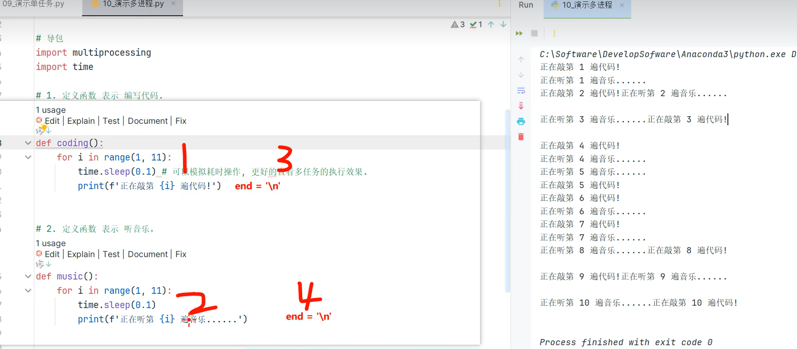

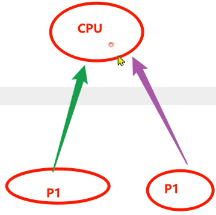


> 谁是第一个都有可能,只是大概率是p1先开始


#### 进程带参数的任务

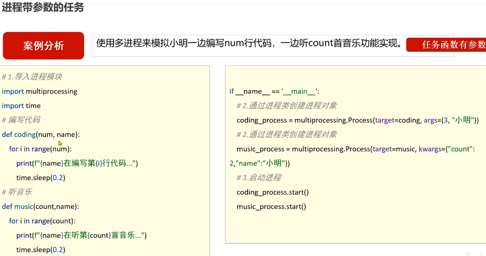

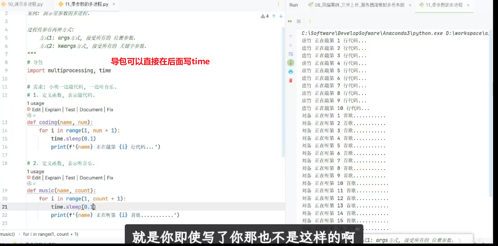

>  导包可以直接在后面写time
>
> 主板的BIOS来设置，进程的资源分配

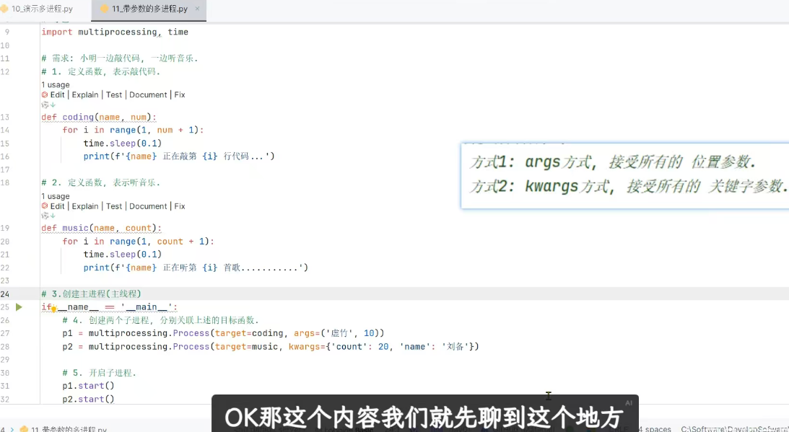

> 1，导包
> 2，创建进程对象，关联目标函数，如果目标函数需要传参，就传个参
> 3，启动
>
> 1.导包，2.编写目标函数，3.创建主进程和子进程，4.启动子进程

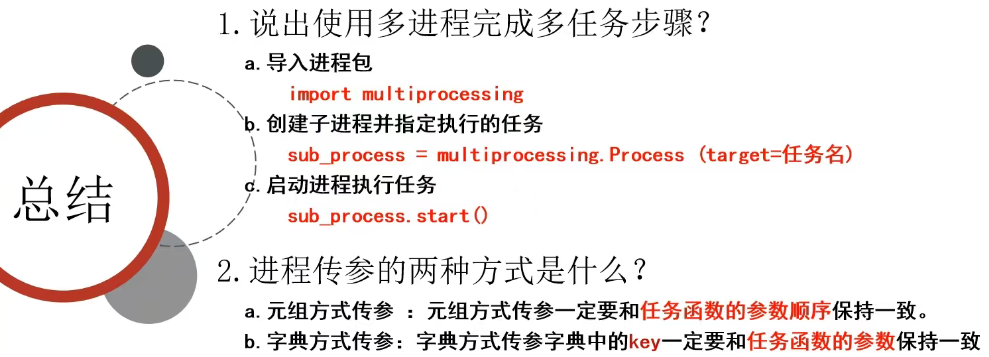

#### 获取进程的父进程的编号有一种方式

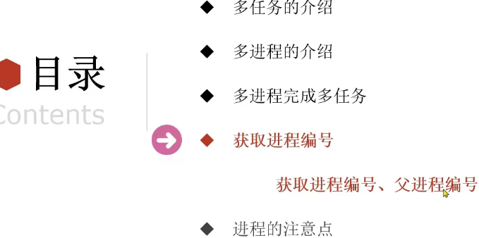


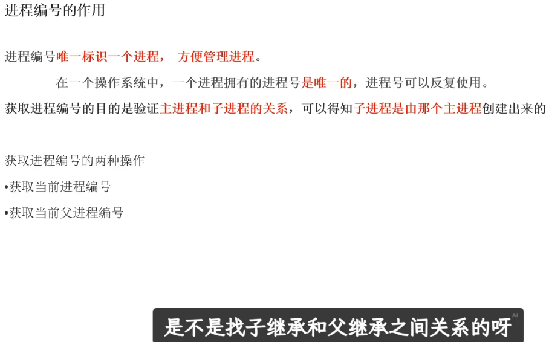

> 进程编号的作用：找子进程和父进程之间关系的

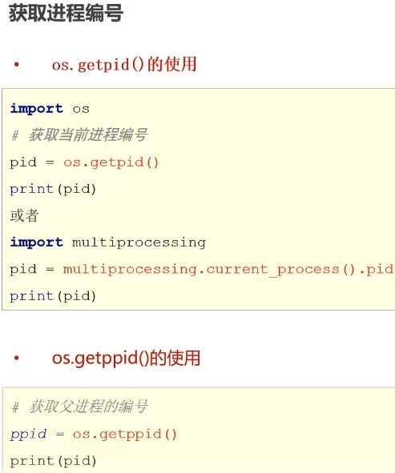

> 获取父进程的编号getparentpid -> os.getppid()

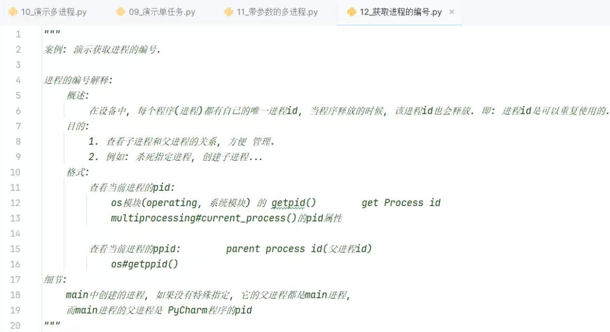

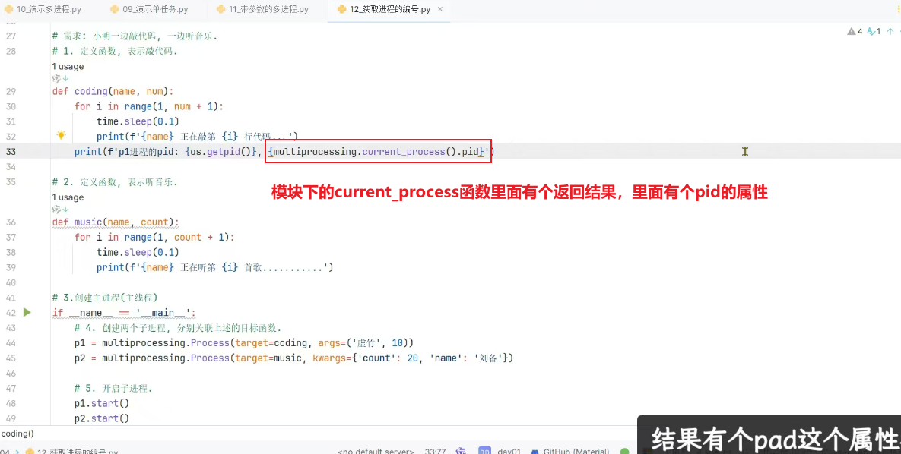


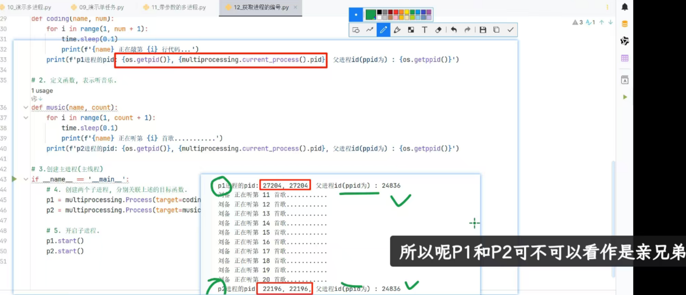

> main函数不需要启动
>
> 因为一开始就启动了就进栈了
>
> main的父进程是 pycharm(pycharm的进程)

> 结束pycharm的进程的时候，那你刚刚还在运行的代码不会运行完，会立马终止

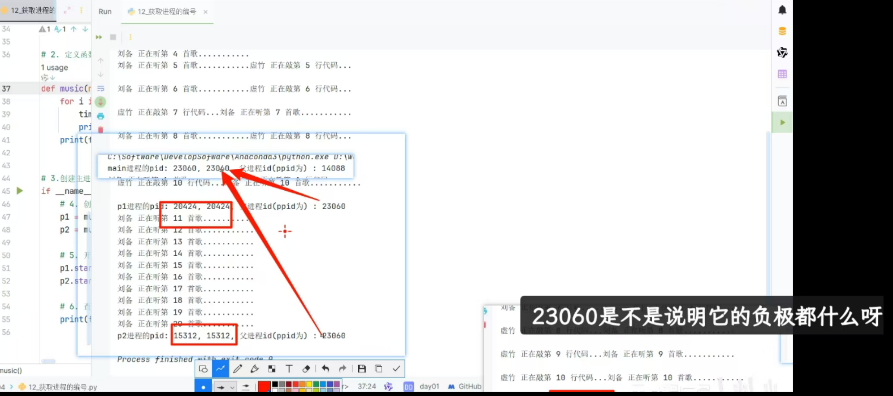

> 23060是不是说明它的父进程都是main进程

> 获取当前进程，两种方式  os.getpid()    multiprocessing.current_process().pid
> 获取父进程，就一种方式 os.getppid()

#### 进程的注意点

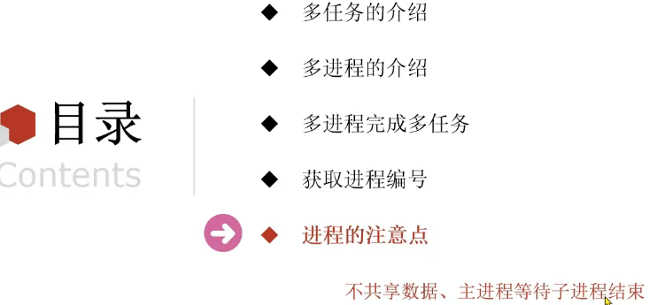

> 不懂，我们需要了解电脑cpu的进程线程吗，我们了解这些的作用是什么？
>
> 不了解进程线程 如何编程开发？

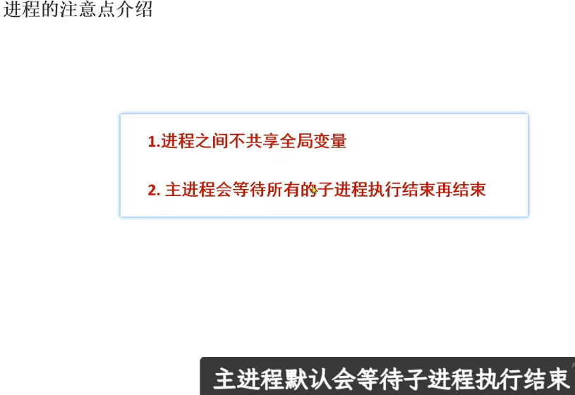


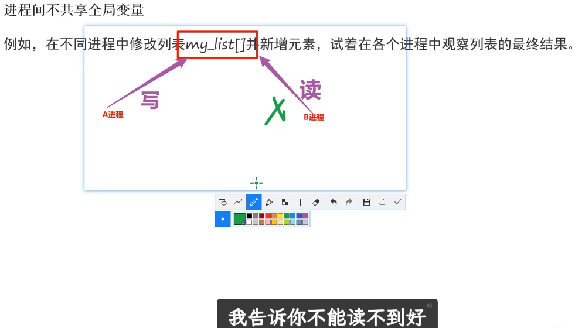

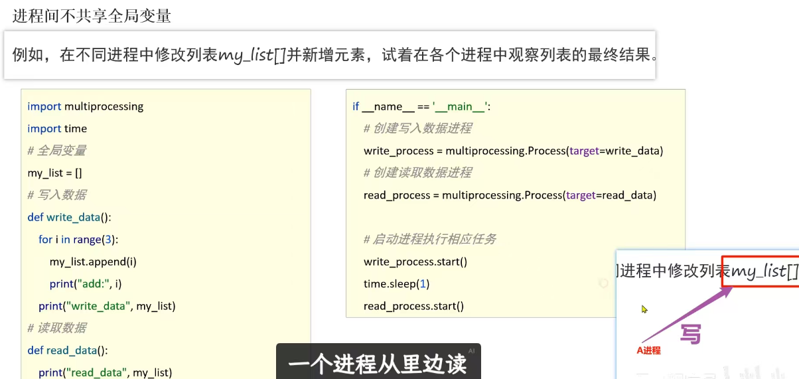

> 相当于在父进程的进程表里
>
> 因为进程是资源分配的基本单位 所以每个进程的资源是独立的

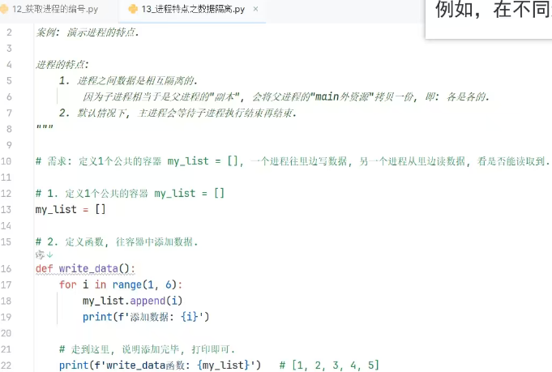


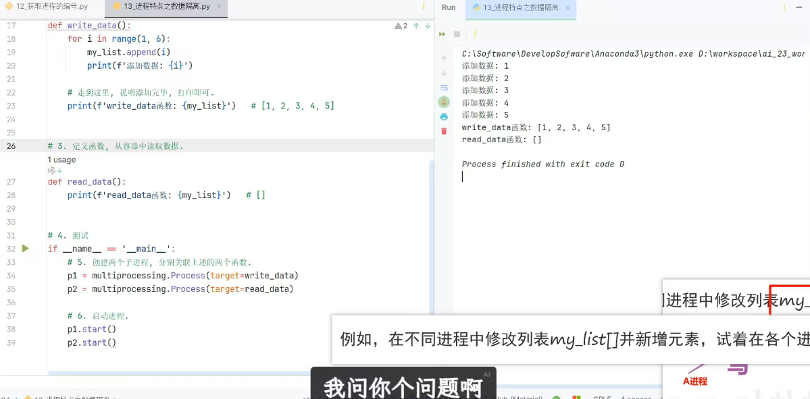


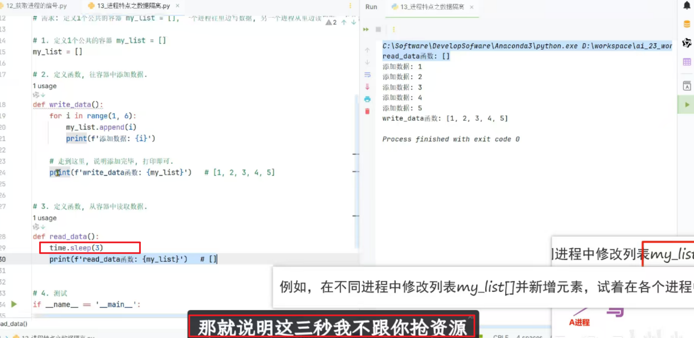


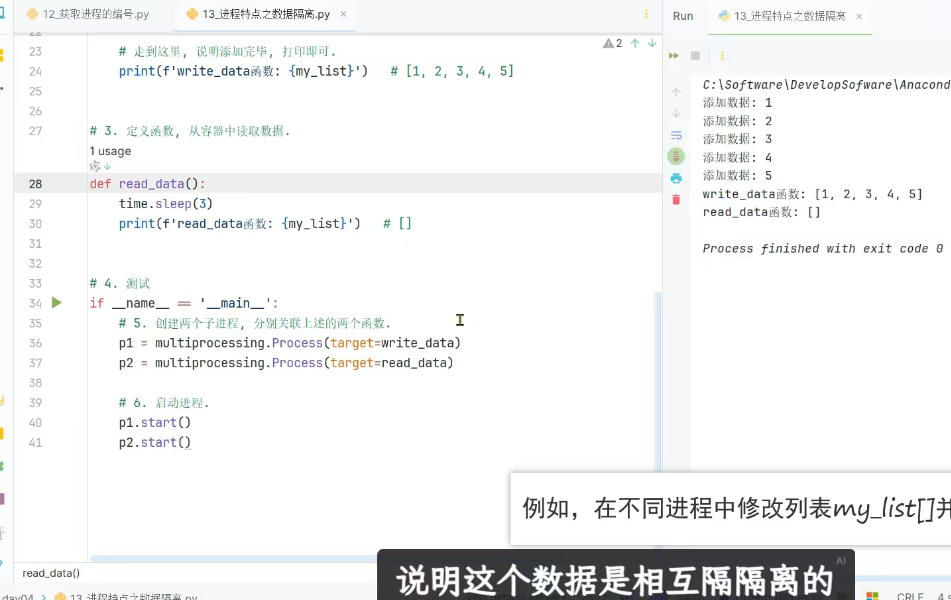

> 说明数据是相互隔离的

> 创建进程开始是会重新加载一次main外文件，所以print多打印了两次

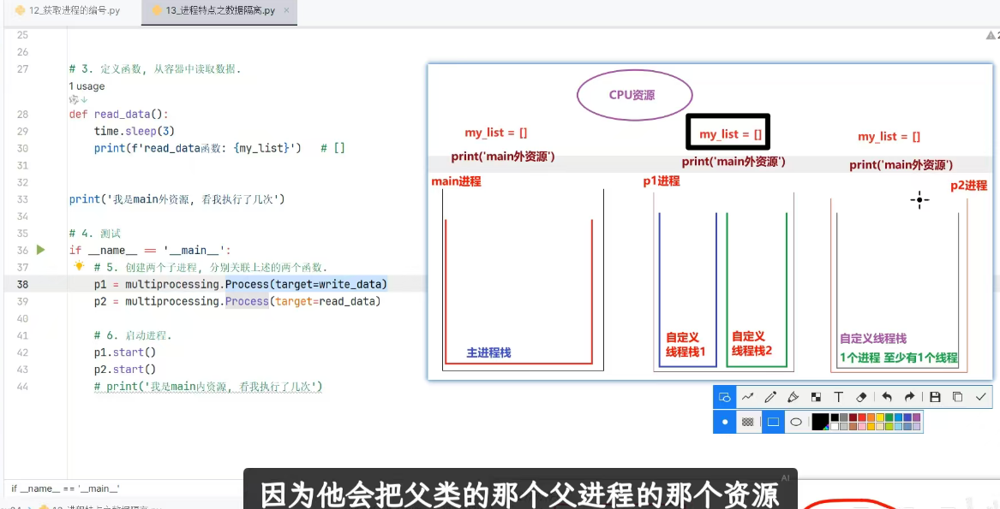

> 全部再拷贝一份

除了变量算资源，那方法函数算资源吗


> \# 全局代码！每个进程都会跑
>
> print(f"我是main外资源，看我执行了几次")

三、怎么验证？

给 print 加个进程名，一眼看懂：

```py
import multiprocessing
import time

# 全局代码！每个进程都会跑
print(f"【{multiprocessing.current_process().name}】执行了全局代码")

my_list = []

def write_data():
    for i in range(1, 6):
        my_list.append(i)
    print(f'write_data: {my_list}')

def read_data():
    time.sleep(3)
    print(f'read_data: {my_list}')

if __name__ == '__main__':
    p1 = multiprocessing.Process(target=write_data, name="写进程")
    p2 = multiprocessing.Process(target=read_data, name="读进程")
    p1.start()
    p2.start()
```

运行结果你会看到：

```py
【MainProcess】执行了全局代码
【写进程】执行了全局代码
【读进程】执行了全局代码
```

**完美对应 3 次！**

------

四、怎么让它只执行 1 次？

把**全局代码放进 `if __name__ == '__main__':` 里面**！

```py
import multiprocessing
import time

my_list = []

def write_data():
    for i in range(1, 6):
        my_list.append(i)
    print(f'write_data: {my_list}')

def read_data():
    time.sleep(3)
    print(f'read_data: {my_list}')

# 只有主进程会进这里
if __name__ == '__main__':
    print('我是main内资源, 只执行1次')  # 现在只打印1次！

    p1 = multiprocessing.Process(target=write_data)
    p2 = multiprocessing.Process(target=read_data)
    p1.start()
    p2.start()
```


> 举个例子，下课铃响了，老师还要挣扎一下，拖拖堂

==daemon 守护==

> 水晶爆了,
>
> 非守护进程嘎的时候,他的所有守护进程都得嘎


> 会在后面随机的一个时间,才会回收


默认情况下,主进程

> terminate的使用场景在哪? 
>
> 子进程卡死了或者不需要子进程陪着主进程到最后


```py
正在努力工作中...  ← 子进程在跑
正在努力工作中...
正在努力工作中...
main进程结束       ← 【主进程代码跑完了，但主进程没退出！它在等子进程！】
正在努力工作中...  ← 子进程继续跑
正在努力工作中...
正在努力工作中...
正在努力工作中...
正在努力工作中...
正在努力工作中...
正在努力工作中...

进程已结束，退出代码为 0  ← 【子进程全部跑完 → 主进程才真正退出】
```

`print ('main 进程结束 ') ≠ 主进程退出！`

- 主进程只是**把自己的代码执行完了**
- 但它**会停在那里，一直等子进程**
- 直到子进程把 10 次全部打印完，主进程才会真正结束

这就是教材说的：

**默认情况下，主进程会等待子进程执行结束再结束！**


### 多线程


> 每个进程都有一个 主线程栈


>  你的线程只能去抢进程分配给你的这些资源诶


#### 多线程完成任务


> 一个开辟通道，一个干活的


## 生成器扩展题

> 其实就是创造出一个新的列表，然后遍历新列表，再对原来的列表进行修改。

> 和java一样去掉元素后，元素向前移位了


>  remove作用在旧的列表上,==s下标指代的是新列表的下标索引==,是不会随着删除元素而改变它里面的元素的

> 💡 关键问题：**删除元素会导致列表长度变短，后续元素左移，而循环索引会继续向后走，直接跳过了被左移的元素**，最终导致漏删。

为什么`my_list[:]`切片能解决问题？

`my_list[:]` 是 Python 的**列表切片语法**，作用是**创建原列表的一个完整浅拷贝（副本）**。

此时循环的逻辑变成：

- 循环遍历的是**副本列表**：`['aa', 'bb', 'cc', 'bb', 'bb', 'bb', 'dd']`
- ==真正修改（删除）的是**原列表`my_list`**==


> .remove(x)是删除列表对象里第一个等于x的元素

### 第二步：牢记两个核心规则

1. **`for` 循环遍历列表**：是**按索引顺序依次取元素**（0→1→2→3→…），索引计数器只会**往后加**，不会往回退；

2. **`list.remove(元素)`**：删除**列表中第一个匹配的元素**，删除后，**后面的所有元素会自动往前挪一位**（索引全部 - 1）；

3. 初始列表（索引 + 元素）：

   ```
   [0:'aa', 1:'bb', 2:'cc', 3:'bb', 4:'bb', 5:'bb', 6:'dd']
   ```

------

第三步：逐次执行循环（最关键！）

我们跟着 Python 的执行逻辑，**一步一步走**：

第 1 次循环：取索引 0 的元素

- `s = 'aa'` → 不等于 `'bb'`
- 不删除，列表无变化
- 循环索引计数器 → 准备取 **索引 1**

第 2 次循环：取索引 1 的元素

- `s = 'bb'` → 匹配，执行 `my_list.remove('bb')`

- ✂️ 删除第一个`bb`（原索引 1），列表瞬间变成：

  ```
  [0:'aa', 1:'cc', 2:'bb', 3:'bb', 4:'bb', 5:'dd']
  ```

- 后面的元素全部**往前挪了 1 位**！

- 循环索引计数器 → 准备取 **索引 2**

第 3 次循环：取索引 2 的元素

- 此时列表索引 2 的元素是 `'bb'` → 匹配，执行 `remove('bb')`

- ✂️ 删除第一个

  ```
  bb
  ```

  （现在索引 2），列表变成：

  ```
  [0:'aa', 1:'cc', 2:'bb', 3:'bb', 4:'dd']
  ```

- 元素又往前挪了！

- 循环索引计数器 → 准备取 **索引 3**

第 4 次循环：取索引 3 的元素

- 此时列表索引 3 的元素是 `'bb'` → 匹配，执行 `remove('bb')`

- ✂️ 删除第一个

  ```
  bb
  ```

  （现在索引 2），列表变成：

  ```
  [0:'aa', 1:'cc', 2:'bb', 3:'dd']
  ```

- 循环索引计数器 → 准备取 **索引 4**

第 5 次循环：取索引 4 的元素

- 现在列表**只有 4 个元素（索引 0-3）**，索引 4 根本不存在！
- 🚫 循环直接结束！

------

第四步：最终结果

去掉 `[:]` 后，运行代码的结果是：

```
['aa', 'cc', 'bb', 'dd']
```

**还剩一个`bb`没删掉！**

------

为什么加 `[:]` 就能删干净？

`my_list[:]` 是**切片浅拷贝**，会生成一个**和原列表一模一样的新列表**：

```
['aa','bb','cc','bb','bb','bb','dd']
```

循环遍历的是**这个新列表**，原列表怎么删、怎么变，都不会影响遍历的新列表，所以能完整遍历所有元素，把所有`bb`都删掉。

------

总结

1. **不加`[:]`**：遍历**原列表**，删元素→元素前移→循环索引递增→**跳过元素**→删不干净；
2. **加`[:]`**：遍历**拷贝的新列表**，原列表修改不影响遍历→**完整遍历所有元素**→删干净。


## 线程的注意点

随机性:CPU做着高效的切换

线程之间共享全局变量


### 线程的特点之主线程会等待子线程的结束再结束

daemon

所以里边有个work这个函数,是目标函数，他的执行时间长，而main里面执行时间短，你会发现主线程结束了，但是子线程还在走，那这种情况下呢可能就不太好（这种情况就是之前说到的，我关闭了微信，但是他里面的聊天功能还在运行，这件事情就很可怕了），那如果我想让他结束，那你就可以设置在这个地方设置你的子线程为守护线程就可以了

怎么设置呢？

第一种就是在定义的时候直接传参

第二种就是通过一个setDaemon

> 注意下面!!


> 在这个函数身上有一道黑色的横线,这种函数你调用还是能调用的,这种函数叫已过时,在新的API里面,已经不支持这种写法了,不建议用(3.8python还能用)
>
> (anaconda的3.12python里不推荐用)


### 线程特点之共享全局变量

> 一个函数往列表里面加,一个函数从列表里面读,看看最终的效果


> 共享全局变量也不意味着一定就好,所以就引出了互斥锁

### 线程特点之共享全局变量数据出现错误问题


> 3.12的特性,总能保证有一个正确结果是2000000
>
> anaconda的版本
>
> 3.8就没有互斥锁的效果


> 线程1还没有来记得执行完(一个完整的动作)前，被线程2抢走了资源，就可能出问题.


> 左边一次,右边一次,加了两次,但是你的值增加了1,就缺了一个1,那这样的动作如果缺的多了,那刚才那个140w这个现象他就有了[信息不同步]

> 解决方法:你俩谁抢到了资源,另一个就进不去


可以共享资源啊 和多进程还是有区别的


### 互斥锁

> 互斥锁会出现两种问题:死锁和锁不住

> 啊?为什么不是真正的多线程?如果不是为什么会出现抢占式调度资源的情况?我倒是知道python的多态是伪多态,但没看到课上说线程也是伪线程啊?


> 那和同步阻塞有什么区别，干嘛还要多线程


这是在混合类型中的运用（在大型多线程项目中，针对特定线程序列），单独拎出来就不能理解了？眼光别太有局限性


> 一个线程一直等待对方释放锁的动作就叫:死锁
>
> 锁不住,就是两把钥匙,它里面正操作呢,你这边拿钥匙开门了


### 进程和线程的对比


> python多进程可以实现并行，而后者无法实现并行，只能并发
>
> 因为资源多，所以更稳定?


> 因为多线程只能去操作共享数据,要加锁了


## python高级与正则表达式

`生成器`，`迭代器`，`property属性`


### 迭代器


> 包括有些函数传参,它上边是不是有一个参数叫它必须传一个iterable 类型,可迭代类型


>  range是一次性加载到内存还是next
>
>  是后者
>
>  ==range（）就是一个迭代器==


> ==显式的实现俩方法==，说白了就是重写


> raise理解为抛出异常,异常信息往控制台一打然后终止,有点像return,返回一个值,然后结束函数
>
> raise就是先返回给你一个异常,再把你的程序终止了,类似与java里面的throws(声明抛出异常)

```py
# __next__是用来获取下一个元素的
```

迭代器就是数据容器吗（迭代器就是range（））


```py
"""
演示自定义迭代器

迭代器介绍:
    概述:
        自定义的类,只要重写了__iter__() 和 __next__()方法,就可以称为迭代器,[你随便写个类,你只要能把这俩写了,那你就是迭代器]
    目的:
        隐藏底层的逻辑,让用户使用更方便
        惰性加载,用的时候才会获取.

回顾:for循环格式
    for i in 可迭代类型:
        pass
"""
# 需求:模拟range(1,6),自定义 迭代器实现同等逻辑
# 场景1:回顾 range()用法
for i in range(1,6):
    print(i)
print('-'*23)

# 场景2:自定义迭代器
# 1.自定义 迭代器类
class MyIterator:
    # 2.通过init魔法方法,初始化属性,指定:范围
    def __init__(self,start,end):
        self.current_value= start       # 当前值,默认为 开始值
        self.end=end                    # 结束值

    # 3.重写iterator魔法方法,返回当前对象(即:迭代器对象).
    def __iter__(self):
        return self

    # 4.重写next方法,返回当前值,并更新当前值
    def __next__(self):
        # 4.1判断当前值是否合法
        if self.current_value >= self.end:
            raise StopIteration
        # 4.2走这里,说明当前值合法,返回当前值,并更新当前值
        # value=self.current_value        # value =              1    2   3   4   5
        # self.current_value+=1           # self.current_value = 2    3   4   5   6
        # return value                    #                      1    2   3   4   5

        # 效果同上,代码更简单
        self.current_value+=1           # self.current_value = 2    3   4   5   6
        return self.current_value-1     #                      1   2   3   4   5

# 5.创建迭代器对象,并遍历
for i in MyIterator(1,6):
    print(i)

# for i in 10:
#     pass
```


> 流数据:就是一个一个往外蹦过来的数据,就跟流水线一样的数据


> next(迭代器对象),next()函数的作用就是得到元素并指针向后移动一位


### python生成器

> 1 生成器的概念?如何使用?
> 存储规则，用数据的时候现场生成
>
> ==数据不是一次性全部生成出来,而是要用的时候,根据规则去生成==
>
> 生成器是 根据一定规则生成数据的一种机制,每次调用生成器只生成一个值,可以节省大量内存

> 生成器归根结底他的目的是就是减少内存空间,**节约内存**
>
> 数据不是一次性全部生成出来,而是使用一个,再生成一个,可以节约大量的内存

> ==生成器是简化的迭代器==

> 生成器就是买家具,那你用一个,我再给你生成一个,而生成器是用一个现生成一个
>
> 迭代器是我把规则放这,一堆的数据我都给你生成好了,你是不是用一个拿一个啊,不用不拿,但是数据还在


> 列表,字典,集合推导式,还少元组推导式,元组推导式没有这个概念,你按照元组的格式写,它其实叫`生成器`

#### 生成器的第一种写法，元组推导式


这个还是需要案例，不然太抽像了，事后还记不住


> 那么如果换成小括号呢,按照我们的设想,是不是应该是元组,但是不,是对象


>  所以啊我想表达意思是没有元组推导式的概念,那你这样写,它其实本质是一个生成器


#### 生成器的第二种写法,yield关键字


```py
# 写个函数，yield往这一标记就ok了

# 需求:通过yield方式,获取到生成器之 1~10 之间的整数
# 回顾:推导式写法
my_g=(i for i in range(1,11))

# yield方式如下
# 1.定义函数,存储到生成器中,并返回
def my_fun():
    # my_list=[]                # 创建
    # for i in range(1,11):
    #     my_list.append(i)     # 添加
    # return my_list            # 返回

    # 效果类似于上边的代码
    # yield在这里做了三件事:1.创建生成器对象 2.把数据保存到生成器对象中 3.返回生成器对象
    for i in range(1,11):
        yield i

# 2.测试
my_g2=my_fun()
print(type(my_g2))      # <class 'generator'>

print(next(my_g2))
print(next(my_g2))
print('-'*23)
for i in my_g2:
    print(i)
```


#### 生成器的应用场景，dataloader的封装


这里其实并没有体现出生成器的特性，文件内容一次性全部加载出来了


>  两个索引分别是idx是生成器的索引，中括号里的切片是lines的索引，lines是个列表，装的是每一行的歌词,==batch_size设置多少==,那一个列表里面==一个元素里就有几行歌词==

这样写完全没有节省内存啊，还更占用内存了，readlines本来就是全部读进了内存，那后面再用生成器有啥意义？应该一行一行读出来然后放进列表，够8条就放进生成器然后清空

 


#### 上午内容回顾


> range底层咋做的,你不知道,但是呢我只会把我的这些批量的数据我提供给你,他是一次性生成所有的数据

> 生成器的目的是减少内存占用,除此以外他跟迭代器是一样的,都是基于规则生成数据的

> yield关键字作用
>
> 1.创建生成器对象
>
> 2.添加元素到生成器
>
> 3.返回


> 如果想要对迭代过程进行高度控制,用迭代器,否则就用生成器

> Property属性


> 正则表达式 
>
> 正则:正确符合规则的字符串
>
> ^异或表示开头
>
> $刀乐表示结尾

> 正则做判断是不是手机号,学规则,正则的作用就是:校验


### Property属性

目的只有一个:


#### 装饰器方式


> 告诉你不能迭代


get_age,set_age... 你这么折腾自己干啥?什么意思?

@==获取值的函数名==.setter

我能不能把get_age我就叫age


> ==但是为了便于调用,实际开发中,私有的属性,我们提供的函数名,都是去掉私有后,你的名字直接写的==
>
> java的get\set方法


> 这里就不标黄了


> 本来就是想访问私有数值


#### Property属性之类属性方式

乌龟的屁股-龟腚

> 类属性的意思就是：你需要做一层封装，什么封装呢？


> 给一个age属性,用property修饰,==把这两个函数(方法)当类属性来用==


> 两个名字不能一样

> 刚刚是因为你的装饰器不一样,别人能够很好的区分,所以获取和设置值方法可以名字一样


### 正则表达式

在Java里边用的是regexp


>  如果是封闭环境开发，可以用猫头鹰校验器,点个高亮,点个match,这边正常写规则,下边就会帮你匹配式子
>
> 匹配到的就会高亮
>
> 如果想要别的,也可以加加加


> 好不能和 i 匹配


> r是取消路径的那个操作,取消转义


> 先接收一个正则返回正则对象
>
> 由正则对象.sub在这里边替换
>
> compile返回的是一个正则对象

```py
"""
演示正则替换

回顾正则的使用步骤:
    1. 导包
    2. 正则匹配
        result = re.match('正则表达式', '要校验的字符串')
        result = re.search('正则表达式', '要校验的字符串')
        result = re.compile('正则表达式').sub(替换后的内容,要被替换的字符串)       替换
    3. 获取匹配结果.
        result.group()
"""
import re

# 1.定义字符串
s='开心你就大声笑,哈哈,呵呵,嘿嘿,嘻嘻,桀桀桀,啦啦啦'

# 2.把上述的 哈,呵,嘿,嘻,桀 替换为 ♥, | 代表或者的意思
#                   正则规则         新字符串  要被替换的字符串
result=re.compile('哈|呵|嘿|嘻|桀').sub('♥',s)

# 3.打印结果
print(result)
print('-'*23)

# 新版API的写法      compile就不需要了
# 参1:正则规则,参2:新字符串,参3:要被替换的字符串
result=re.sub('哈|呵|嘿|嘻|桀', '♣①', s)     # 各个公司都有自己的敏感词库
print(result)
```


### 正则表达式编写

#### 单个字符


> 


> []代表括号中的任意一个就欧克


#### 多个字符


> *不能单独出现


#### 使用re模块匹配指定字符串开头或结尾


#### re模块提取分组数据

##### |


##### ()


##### \num,单级的html


> 网页横线网上全都是head
>
> 往下都是body


> 这个杠1并不是简单的让代码少些一点，还有一个特殊的功能


> \1引用第1组,要求要和第1组的内容一模一样,而不是遵循和分组1一样的正则规则就行
>
> ==就是第一组内容是啥，引用的内容就得是啥。 他开始搞错了以为是引用的规则。==


##### 扩展,多级的html


>  设置分组名 (?P==<==分组名==>==该组的re)  使用分组名==(?P=分组名)==


```py
import re

# 1需求:在列表中["apple","banana","orange","pear"]，匹配apple和pear
# list=["apple","banana","orange","pear"]
#
# for s in list:
#     result=re.match('apple|pear',s)
#     if result:
#         print(f"我喜欢吃的水果:{result.group()}")
#     else:
#         print(f"我不喜欢吃的水果:{s}")

# 2需求:匹配出163、126、qq等邮箱
# email='abcd@163.com'
# result=re.match('^[a-zA-Z_0-9]{4,}@(163|126|qq)\.com',email)
# print(result.group())

# 3需求:匹配qq:10567这样的数据，提取出来qq文字和qq号码
# s="qq:10567"
# result=re.match('(qq):(\d*)',s)
# if result:
#     print(f"qq={result.group(1)}")
#     print(f"号码：{result.group(2)}")
# else:
#     print("匹配失败")
# 4需求:匹配出<html>hh</html>
html_s="<html>hh</html>"
# result=re.match('<html>.*</html>',html_s)
result=re.match(r'<(html)>.*</\1>',html_s)    # 出现了右斜杠(Windows的反骨)就要用r转义
print(result.group())

# 5需求:匹配出<html><h1>www.itcast.cn</h1></html>
html_s="<html><h1>www.itcast.cn</h1></html>"
result=re.match(r'<(?P<A>html)><(?P<B>h1)>.*</(?P=B)></(?P=A)>',html_s)
print(result.group())
```


## 数据结构与算法

...


# 重要点,多记几遍

## 类操作

```py
# 创建类对象
对象名=类()
# 类外,设置属性,获取属性
对象名.属性名="xxx"
对象名.属性名
对象名.方法名()
```

> 类属性可以通过对象名.的方式调用,也可以通过类名.的方式调用


## 🧠 为什么要加 `global` 声明？核心是「Python 的变量作用域规则」

你说的没错：**全局变量在函数里「读」是可以直接用的，但「写」必须加 `global` 声明**，这是 Python 最容易踩的坑之一！

------

一、先看两个对比，一眼懂区别

1. 只「读」全局变量：不用 `global`，完全正常

```
global_num = 0

def test_read():
    # 只读取，不修改
    print(global_num)  # 正常输出 0，不需要 global

test_read()
```

2. 要「写」（修改）全局变量：不加 `global` 直接报错

```
global_num = 0

def test_write():
    # 尝试修改，没加 global
    global_num += 1  # ❌ 报错：UnboundLocalError: local variable 'global_num' referenced before assignment
    print(global_num)

test_write()
```

3. 加了 `global` 声明：修改成功

```
global_num = 0

def test_write():
    global global_num  # ✅ 声明：我要修改全局的 global_num
    global_num += 1
    print(global_num)  # 正常输出 1

test_write()
print(global_num)  # 全局变量也变成了 1
```

------

二、背后的核心规则：Python 的「LEGB 作用域」

Python 解释器在查找变量时，遵循严格的优先级：

1. **L（Local）**：当前函数 / 方法的局部作用域
2. **E（Enclosing）**：外层嵌套函数的作用域
3. **G（Global）**：模块级的全局作用域
4. **B（Built-in）**：Python 内置作用域（如 `print`、`len`）

关键规则：

- **如果只是读取变量**：解释器会按 L→E→G→B 顺序查找，找不到就报错。
- 如果要给变量赋值（写操作）：
  - 解释器**默认认为这是「创建局部变量」**，直接在局部作用域创建同名变量，**完全屏蔽全局变量**。
  - 如果你**没有提前声明 `global`**，就会出现「先引用、后创建」的错误（比如 `global_num += 1` 本质是 `global_num = global_num + 1`，右边要读、左边要写，解释器认为右边读的是局部变量，但还没创建，就报错了）。
