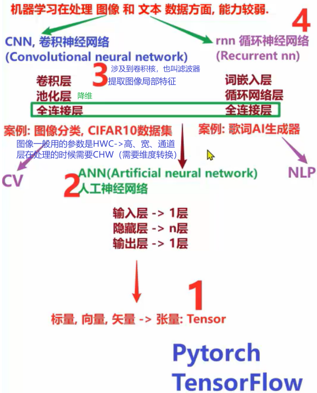
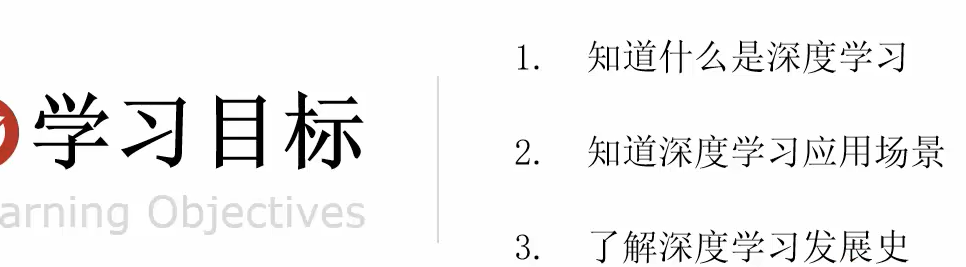

# 深度学习

【python进阶】闭包装饰器的一个数据集，分批加载数据的：一个数据集：【结论歌词】5819条数据，歌词AI生成器

结巴分词器：朴素贝叶斯（唯一一个靠概率就能做分类的机器学习算法），（商品评论，情感分析）20条评论，先用结巴切词，切完以后得到37个词，然后把37个词带到评论当中，如果评论里有这个词，我就用1表示，没有就用0表示，所以最终所有的文本全都是一个长度为37，然后0101这样一个列表组成的。

5819--去重-->5703个去重后的词，把这些词生成序号，生成对应的维度，就是数值，再来预测

给我一个5703个其中之一的词，我生成歌词

标量、向量、矢量 -> 张量：Tensor

tensorflow的区别在于计算步骤（计算路径）：tensorflow生成的是一个静态图，你的模型除非训练完，就是中间不能做修改的

pytorch生成的是一个动态图，可以边生成，边修改，其次他的API更简单

## 深度学习简介

