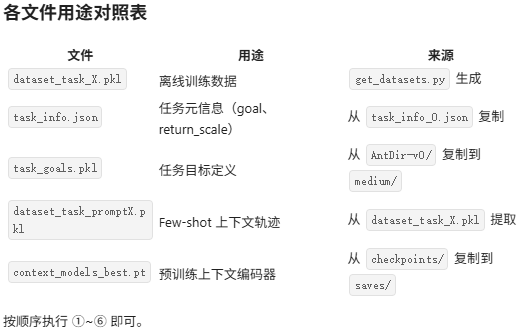

# Meta Decision Transformer(Meta-DT)


## 理解任务（做什么）

我们预训练一个上下文感知世界模型来学习紧凑的任务表示,并将其作为上下文条件注入到因果Transformer中,以指导面向任务的序列生成。

“新颖的离线元强 化学习框架,它借鉴了条件序列建模的进展,具有强大的任务表示学习能力” (Wang 等, p. 4)

“设计了一 种互补提示以在未见任务上进行有效泛化” (Wang 等, p. 4)


## 动机（为什么做这个）

“能否设计一个 离线元RL框架,在利用可扩展Transformer架构的序列建模范式进展的同时,实现对未见过 任务的高效泛化?” (Wang 等, p. 2)


## 方法原理（怎么做的）


## 实验


## 名词解释

###  “任务信念” 

解释：它指的是智能体对当前任务的一种内部表示或推断，包含了完成该任务所需的关键信息。


## 复现

服务器使用的是国内的网络

==pip不行就换源，git不行就转换链接==

requirements.txt里使用代理

> gym==0.17.3
>
> numpy==1.19.5
>
> torch==1.11.0
>
> transformers==4.5.1
>
> mujoco-py==2.1.2.14
>
> \# cython==3.0.0a10
>
> cython==0.29.37
>
> pygame==2.1.0
>
> pytest==6.2.5
>
> matplotlib==3.5.1
>
> \# git+https://github.com/dennisl88/rand_param_envs.git@4d1529d61ca0d65ed4bd9207b108d4a4662a4da0#egg=rand_param_envs
>
> tensorboard==2.13.0

```
pip install xxxxxxx   -i 清华源
git+https://ghproxy.com/https://github.com/dennisl88/rand_param_envs.git@4d1529d61ca0d65ed4bd9207b108d4a4662a4da0#egg=rand_param_envs
```

安装d4rl

```
git clone https://github.com/Farama-Foundation/d4rl.git
cd d4rl
pip install -e .
```

安装mujoco

```
To include mujoco-py in your own package, add it to your requirements like so:

mujoco-py<2.2,>=2.1
```

mujoco-py 编译错误，缺少 `X11/Xlib.h` 头文件。

```
sudo apt-get install libx11-dev libosmesa6-dev 
libgl1-mesa-glx libglfw3 patchelf -y
```

又缺一个头文件：`GL/glew.h`，需要安装 GLEW 开发库。

```
sudo apt-get install libglew-dev -y
```

虚拟屏幕安装参考：[linux安装虚拟屏幕输出-CSDN博客](https://blog.csdn.net/sevendemage/article/details/136606576)

```bash
# 1. 解压数据集到 datasets/ 目录
unzip 你的数据集压缩包.zip -d /home/litong/LizhijunWorkspace/Meta-DT/datasets/

# 2. 解压预训练世界模型到 models/ 或 checkpoints/ 目录
# 项目会保存 context encoder 和 world model 到 ./checkpoints/ 目录
mkdir -p /home/litong/LizhijunWorkspace/Meta-DT/checkpoints
unzip 你的世界模型压缩包.zip -d /home/litong/LizhijunWorkspace/Meta-DT/checkpoints/
```

```bash
unzip saves.zip -d /home/litong/LizhijunWorkspace/Meta-DT/checkpoints/
```

世界模型saves的压缩包解压到Meta-DT/底下，并且重命名为Meta-DT/checkpoints/


```
python get_datasets.py --env_type ant_dir --data_type medium --task_id_start 0 --task_id_end 5 --capacity 20000
```


==Prompt轨迹缺少next_observations字段。修复：==ai写的这段 Python 脚本就是填补了这个坑——从 `dataset_task_X.pkl`（扁平 OrderedDict）中按每 200 步切割成轨迹列表，再取前 3 条作为 prompt。这正是作者在自己机器上干了但没提交到仓库的操作。

```py
python << 'EOF'
import pickle
import numpy as np

traj_len = 200

for task_id in range(5):
    with open(f'datasets/AntDir-v0/medium/dataset_task_{task_id}.pkl', 'rb') as f:
        data = pickle.load(f)
    
    num_trajs = data['observations'].shape[0] // traj_len
    
    trajectories = []
    for i in range(num_trajs):
        s, e = i * traj_len, (i + 1) * traj_len
        trajectories.append({
            'observations': data['observations'][s:e],
            'next_observations': data['next_observations'][s:e],
            'actions': data['actions'][s:e],
            'rewards': data['rewards'][s:e],
        })
    
    prompt = trajectories[:3]
    with open(f'datasets/AntDir-v0/medium/dataset_task_prompt{task_id}.pkl', 'wb') as f:
        pickle.dump(prompt, f)
    
    print(f'Generated dataset_task_prompt{task_id}.pkl ({len(prompt)} trajectories)')

print('Done!')
EOF
```




==dataset_task_promptX.pkl==从==dataset_task_0.pkl==提取

作者几乎 100% 也是用同样的逻辑切的——因为数据格式是确定的，切割方式也只有一种正确做法。只是他没把这段代码放进 GitHub。


**训练完成后的完整复现路线**

`train_meta_dt.py` 已经内置了训练 + 评估 + TensorBoard 日志，训练完后结果在 `results/` 目录下。

当前你的 AntDi当前你的 AntDir-v0 few-shot 跑完后，接着做：r-v0 few-shot 跑完后，接着做：

### ① Zero-shot Meta-DT

```bash
python train_meta_dt.py --env_type ant_dir --env_name AntDir-v0 --zero_shot True --data_quality medium --num_tasks 5 --num_train_tasks 3
```

当 `--zero_shot True` 时，模型不依赖 prompt 轨迹，直接根据上下文编码器进行 zero-shot 泛化。

### ② 其他环境（完整复现论文需要）

| 环境              | Few-shot 命令                                                |
| ----------------- | ------------------------------------------------------------ |
| HalfCheetahVel    | `python train_meta_dt.py --env_type cheetah_vel --env_name HalfCheetahVel-v0 --zero_shot False --data_quality medium` |
| HalfCheetahDir    | `python train_meta_dt.py --env_type cheetah_dir --env_name HalfCheetahDir-v0 --zero_shot False --data_quality medium` |
| HopperRandParams  | `python train_meta_dt.py --env_type hopper --env_name HopperRandParams-v0 --zero_shot False --data_quality medium` |
| WalkerRandParams  | `python train_meta_dt.py --env_type walker --env_name WalkerRandParams-v0 --zero_shot False --data_quality medium` |
| Reach (MetaWorld) | `python train_meta_dt.py --env_type reach --env_name Reach-v2 --zero_shot False --data_quality medium` |

每个环境也需要先完成数据收集 + 生成数据集，然后各跑一个 few-shot 和 zero-shot。

### ③ 论文图表怎么来的？

==训练脚本的日志目录是 **`runs/`**，不是 `results/`。==

训练过程中 TensorBoard 自动记录到 `results/` 目录。运行：

```bash
tensorboard --logdir runs/ --port 6006 --bind_all
```

如果你在 Windows 上开了代理/VPN

也可能是代理占用了 6006。关闭代理再试，或者干脆换个冷门端口：

```
ssh -L 18888:localhost:6006 litong@9.tcp.vip.cpolar.cn -p 13035
```

浏览器打开 **`http://localhost:18888`**,可以看到：

| 指标                 | 含义                                             |
| -------------------- | ------------------------------------------------ |
| `train/loss`         | 训练损失曲线                                     |
| `return/train tasks` | 训练任务平均回报（对应论文 Table 里的 Train 列） |
| `return/test tasks`  | 测试任务平均回报（对应论文 Table 里的 Test 列）  |

论文里的学习曲线图、Table 数据就是从这些 TensorBoard 日志中提取的。


# 复现记录

## 一、环境准备（只需做一次）

```bash
# 进入项目目录
cd /home/litong/LizhijunWorkspace/Meta-DT

# 创建虚拟环境（如果还没创建）
conda create -n meta_dt python=3.8 -y
conda activate meta_dt

# 安装依赖
pip install -r requirements.txt
# 注意：MuJoCo 已安装，环境变量已配好
```

## 二、数据收集（SAC 训练）—— 每个环境 × 所有任务

### 2.1 AntDir（50 个任务，每批 5 个）

```bash
python train_data_collection.py --env_type ant_dir --save_freq 4000 --task_id_start 0 --task_id_end 5❤️
python train_data_collection.py --env_type ant_dir --save_freq 4000 --task_id_start 5 --task_id_end 10❤️
python train_data_collection.py --env_type ant_dir --save_freq 4000 --task_id_start 10 --task_id_end 15❤️
python train_data_collection.py --env_type ant_dir --save_freq 4000 --task_id_start 15 --task_id_end 20❤️
python train_data_collection.py --env_type ant_dir --save_freq 4000 --task_id_start 20 --task_id_end 25❤️
python train_data_collection.py --env_type ant_dir --save_freq 4000 --task_id_start 25 --task_id_end 30❤️
python train_data_collection.py --env_type ant_dir --save_freq 4000 --task_id_start 30 --task_id_end 35❤️
python train_data_collection.py --env_type ant_dir --save_freq 4000 --task_id_start 35 --task_id_end 40❤️
python train_data_collection.py --env_type ant_dir --save_freq 4000 --task_id_start 40 --task_id_end 45❤️
python train_data_collection.py --env_type ant_dir --save_freq 4000 --task_id_start 45 --task_id_end 50❤️
```

### 2.2 HalfCheetahVel（50 个任务，每批 5 个）

```bash
python train_data_collection.py --env_type cheetah_vel --save_freq 4000 --task_id_start 0 --task_id_end 5❤️
python train_data_collection.py --env_type cheetah_vel --save_freq 4000 --task_id_start 5 --task_id_end 10❤️
python train_data_collection.py --env_type cheetah_vel --save_freq 4000 --task_id_start 10 --task_id_end 15❤️
python train_data_collection.py --env_type cheetah_vel --save_freq 4000 --task_id_start 15 --task_id_end 20❤️
python train_data_collection.py --env_type cheetah_vel --save_freq 4000 --task_id_start 20 --task_id_end 25❤️
python train_data_collection.py --env_type cheetah_vel --save_freq 4000 --task_id_start 25 --task_id_end 30❤️
python train_data_collection.py --env_type cheetah_vel --save_freq 4000 --task_id_start 30 --task_id_end 35❤️
python train_data_collection.py --env_type cheetah_vel --save_freq 4000 --task_id_start 35 --task_id_end 40❤️
python train_data_collection.py --env_type cheetah_vel --save_freq 4000 --task_id_start 40 --task_id_end 45	#看环境代码 half_cheetah_vel.py：velocities = np.linspace(0.075, 3, 40)  # ← 只有 40 个！-----所以到上一行为止就跑完了
python train_data_collection.py --env_type cheetah_vel --save_freq 4000 --task_id_start 45 --task_id_end 50
```

### 2.3 HalfCheetahDir（4 个任务，只需跑一次）

```bash
python train_data_collection.py --env_type cheetah_dir --save_freq 4000 --task_id_start 0 --task_id_end 4❤️
```

### 2.4 Hopper（50 个任务，每批 5 个）

```bash
python train_data_collection.py --env_type hopper --save_freq 4000 --task_id_start 0 --task_id_end 5❤️
python train_data_collection.py --env_type hopper --save_freq 4000 --task_id_start 5 --task_id_end 10❤️
python train_data_collection.py --env_type hopper --save_freq 4000 --task_id_start 10 --task_id_end 15❤️
python train_data_collection.py --env_type hopper --save_freq 4000 --task_id_start 15 --task_id_end 20❤️
python train_data_collection.py --env_type hopper --save_freq 4000 --task_id_start 20 --task_id_end 25❤️
python train_data_collection.py --env_type hopper --save_freq 4000 --task_id_start 25 --task_id_end 30❤️
python train_data_collection.py --env_type hopper --save_freq 4000 --task_id_start 30 --task_id_end 35❤️
python train_data_collection.py --env_type hopper --save_freq 4000 --task_id_start 35 --task_id_end 40❤️
python train_data_collection.py --env_type hopper --save_freq 4000 --task_id_start 40 --task_id_end 45❤️
python train_data_collection.py --env_type hopper --save_freq 4000 --task_id_start 45 --task_id_end 50❤️
```

### 2.5 Walker（50 个任务，每批 5 个）

```bash
python train_data_collection.py --env_type walker --save_freq 4000 --task_id_start 0 --task_id_end 5❤️
python train_data_collection.py --env_type walker --save_freq 4000 --task_id_start 5 --task_id_end 10❤️
python train_data_collection.py --env_type walker --save_freq 4000 --task_id_start 10 --task_id_end 15❤️
python train_data_collection.py --env_type walker --save_freq 4000 --task_id_start 15 --task_id_end 20❤️
python train_data_collection.py --env_type walker --save_freq 4000 --task_id_start 20 --task_id_end 25❤️
python train_data_collection.py --env_type walker --save_freq 4000 --task_id_start 25 --task_id_end 30❤️
python train_data_collection.py --env_type walker --save_freq 4000 --task_id_start 30 --task_id_end 35❤️
python train_data_collection.py --env_type walker --save_freq 4000 --task_id_start 35 --task_id_end 40❤️
python train_data_collection.py --env_type walker --save_freq 4000 --task_id_start 40 --task_id_end 45❤️
python train_data_collection.py --env_type walker --save_freq 4000 --task_id_start 45 --task_id_end 50❤️
```

### 2.6 PointRobot（50 个任务，每批 5 个）

```bash
python train_data_collection.py --env_type point_robot --save_freq 4000 --task_id_start 0 --task_id_end 5❤️
python train_data_collection.py --env_type point_robot --save_freq 4000 --task_id_start 5 --task_id_end 10❤️
python train_data_collection.py --env_type point_robot --save_freq 4000 --task_id_start 10 --task_id_end 15❤️
python train_data_collection.py --env_type point_robot --save_freq 4000 --task_id_start 15 --task_id_end 20❤️
python train_data_collection.py --env_type point_robot --save_freq 4000 --task_id_start 20 --task_id_end 25❤️
python train_data_collection.py --env_type point_robot --save_freq 4000 --task_id_start 25 --task_id_end 30❤️
python train_data_collection.py --env_type point_robot --save_freq 4000 --task_id_start 30 --task_id_end 35❤️
python train_data_collection.py --env_type point_robot --save_freq 4000 --task_id_start 35 --task_id_end 40❤️
python train_data_collection.py --env_type point_robot --save_freq 4000 --task_id_start 40 --task_id_end 45❤️
python train_data_collection.py --env_type point_robot --save_freq 4000 --task_id_start 45 --task_id_end 50❤️
```

### 2.7 Reach（20 个任务，每批 5 个）

```bash
python train_data_collection.py --env_type reach --save_freq 4000 --task_id_start 0 --task_id_end 5❤️
python train_data_collection.py --env_type reach --save_freq 4000 --task_id_start 5 --task_id_end 10
python train_data_collection.py --env_type reach --save_freq 4000 --task_id_start 10 --task_id_end 15
python train_data_collection.py --env_type reach --save_freq 4000 --task_id_start 15 --task_id_end 20
```

> **注意：** 你之前跑的 AntDir 的 task_0 和 task_1 已经跑完。上面其他环境和任务需要重新跑。

------

## 三、生成离线数据集（medium）—— 每个环境 × 所有任务

### 3.1 AntDir（50 个任务，每批 5 个）

Bash


```bash
python get_datasets.py --env_type ant_dir --data_type medium --task_id_start 0 --task_id_end 5 --capacity 20000
python get_datasets.py --env_type ant_dir --data_type medium --task_id_start 5 --task_id_end 10 --capacity 20000
python get_datasets.py --env_type ant_dir --data_type medium --task_id_start 10 --task_id_end 15 --capacity 20000
python get_datasets.py --env_type ant_dir --data_type medium --task_id_start 15 --task_id_end 20 --capacity 20000
python get_datasets.py --env_type ant_dir --data_type medium --task_id_start 20 --task_id_end 25 --capacity 20000
python get_datasets.py --env_type ant_dir --data_type medium --task_id_start 25 --task_id_end 30 --capacity 20000
python get_datasets.py --env_type ant_dir --data_type medium --task_id_start 30 --task_id_end 35 --capacity 20000
python get_datasets.py --env_type ant_dir --data_type medium --task_id_start 35 --task_id_end 40 --capacity 20000
python get_datasets.py --env_type ant_dir --data_type medium --task_id_start 40 --task_id_end 45 --capacity 20000
python get_datasets.py --env_type ant_dir --data_type medium --task_id_start 45 --task_id_end 50 --capacity 20000
```

### 3.2 HalfCheetahVel（50 个任务，每批 5 个）

Bash


```bash
python get_datasets.py --env_type cheetah_vel --data_type medium --task_id_start 0 --task_id_end 5 --capacity 20000
python get_datasets.py --env_type cheetah_vel --data_type medium --task_id_start 5 --task_id_end 10 --capacity 20000
python get_datasets.py --env_type cheetah_vel --data_type medium --task_id_start 10 --task_id_end 15 --capacity 20000
python get_datasets.py --env_type cheetah_vel --data_type medium --task_id_start 15 --task_id_end 20 --capacity 20000
python get_datasets.py --env_type cheetah_vel --data_type medium --task_id_start 20 --task_id_end 25 --capacity 20000
python get_datasets.py --env_type cheetah_vel --data_type medium --task_id_start 25 --task_id_end 30 --capacity 20000
python get_datasets.py --env_type cheetah_vel --data_type medium --task_id_start 30 --task_id_end 35 --capacity 20000
python get_datasets.py --env_type cheetah_vel --data_type medium --task_id_start 35 --task_id_end 40 --capacity 20000
python get_datasets.py --env_type cheetah_vel --data_type medium --task_id_start 40 --task_id_end 45 --capacity 20000
python get_datasets.py --env_type cheetah_vel --data_type medium --task_id_start 45 --task_id_end 50 --capacity 20000
```

### 3.3 HalfCheetahDir（4 个任务，一次跑完）

Bash


```bash
python get_datasets.py --env_type cheetah_dir --data_type medium --task_id_start 0 --task_id_end 4 --capacity 20000
```

### 3.4 Hopper（50 个任务，每批 5 个）

Bash


```bash
python get_datasets.py --env_type hopper --data_type medium --task_id_start 0 --task_id_end 5 --capacity 20000
python get_datasets.py --env_type hopper --data_type medium --task_id_start 5 --task_id_end 10 --capacity 20000
python get_datasets.py --env_type hopper --data_type medium --task_id_start 10 --task_id_end 15 --capacity 20000
python get_datasets.py --env_type hopper --data_type medium --task_id_start 15 --task_id_end 20 --capacity 20000
python get_datasets.py --env_type hopper --data_type medium --task_id_start 20 --task_id_end 25 --capacity 20000
python get_datasets.py --env_type hopper --data_type medium --task_id_start 25 --task_id_end 30 --capacity 20000
python get_datasets.py --env_type hopper --data_type medium --task_id_start 30 --task_id_end 35 --capacity 20000
python get_datasets.py --env_type hopper --data_type medium --task_id_start 35 --task_id_end 40 --capacity 20000
python get_datasets.py --env_type hopper --data_type medium --task_id_start 40 --task_id_end 45 --capacity 20000
python get_datasets.py --env_type hopper --data_type medium --task_id_start 45 --task_id_end 50 --capacity 20000
```

### 3.5 Walker（50 个任务，每批 5 个）

Bash


```bash
python get_datasets.py --env_type walker --data_type medium --task_id_start 0 --task_id_end 5 --capacity 20000
python get_datasets.py --env_type walker --data_type medium --task_id_start 5 --task_id_end 10 --capacity 20000
python get_datasets.py --env_type walker --data_type medium --task_id_start 10 --task_id_end 15 --capacity 20000
python get_datasets.py --env_type walker --data_type medium --task_id_start 15 --task_id_end 20 --capacity 20000
python get_datasets.py --env_type walker --data_type medium --task_id_start 20 --task_id_end 25 --capacity 20000
python get_datasets.py --env_type walker --data_type medium --task_id_start 25 --task_id_end 30 --capacity 20000
python get_datasets.py --env_type walker --data_type medium --task_id_start 30 --task_id_end 35 --capacity 20000
python get_datasets.py --env_type walker --data_type medium --task_id_start 35 --task_id_end 40 --capacity 20000
python get_datasets.py --env_type walker --data_type medium --task_id_start 40 --task_id_end 45 --capacity 20000
python get_datasets.py --env_type walker --data_type medium --task_id_start 45 --task_id_end 50 --capacity 20000
```

### 3.6 PointRobot（50 个任务，每批 5 个）

Bash


```bash
python get_datasets.py --env_type point_robot --data_type medium --task_id_start 0 --task_id_end 5 --capacity 20000
python get_datasets.py --env_type point_robot --data_type medium --task_id_start 5 --task_id_end 10 --capacity 20000
python get_datasets.py --env_type point_robot --data_type medium --task_id_start 10 --task_id_end 15 --capacity 20000
python get_datasets.py --env_type point_robot --data_type medium --task_id_start 15 --task_id_end 20 --capacity 20000
python get_datasets.py --env_type point_robot --data_type medium --task_id_start 20 --task_id_end 25 --capacity 20000
python get_datasets.py --env_type point_robot --data_type medium --task_id_start 25 --task_id_end 30 --capacity 20000
python get_datasets.py --env_type point_robot --data_type medium --task_id_start 30 --task_id_end 35 --capacity 20000
python get_datasets.py --env_type point_robot --data_type medium --task_id_start 35 --task_id_end 40 --capacity 20000
python get_datasets.py --env_type point_robot --data_type medium --task_id_start 40 --task_id_end 45 --capacity 20000
python get_datasets.py --env_type point_robot --data_type medium --task_id_start 45 --task_id_end 50 --capacity 20000
```

### 3.7 Reach（20 个任务，每批 5 个）

Bash


```bash
python get_datasets.py --env_type reach --data_type medium --task_id_start 0 --task_id_end 5 --capacity 20000
python get_datasets.py --env_type reach --data_type medium --task_id_start 5 --task_id_end 10 --capacity 20000
python get_datasets.py --env_type reach --data_type medium --task_id_start 10 --task_id_end 15 --capacity 20000
python get_datasets.py --env_type reach --data_type medium --task_id_start 15 --task_id_end 20 --capacity 20000
```

------

## 四、为每个环境生成 prompt 文件（作者没写这段，需要自己跑）

**每个环境执行一次**（以 AntDir 为例，其他环境同理，只是把 task_id 的 5 改成对应环境的总任务数）：

Bash


```bash
# AntDir（50 个 task，prompt_length=5）
python << 'EOF'
import pickle
import numpy as np
traj_len = 200
for task_id in range(50):
    with open(f'datasets/AntDir-v0/medium/dataset_task_{task_id}.pkl', 'rb') as f:
        data = pickle.load(f)
    trajectories = []
    for i in range(100):  # 100 trajectories (20000 / 200)
        s, e = i * traj_len, (i + 1) * traj_len
        trajectories.append({
            'observations': data['observations'][s:e],
            'next_observations': data['next_observations'][s:e],
            'actions': data['actions'][s:e],
            'rewards': data['rewards'][s:e],
        })
    prompt = trajectories[:5]
    with open(f'datasets/AntDir-v0/medium/dataset_task_prompt{task_id}.pkl', 'wb') as f:
        pickle.dump(prompt, f)
print('AntDir prompt files generated!')
EOF

# HalfCheetahVel（50 个 task，prompt_length=5）
python << 'EOF'
import pickle
import numpy as np
traj_len = 200
for task_id in range(50):
    with open(f'datasets/HalfCheetahVel-v0/medium/dataset_task_{task_id}.pkl', 'rb') as f:
        data = pickle.load(f)
    trajectories = []
    for i in range(100):
        s, e = i * traj_len, (i + 1) * traj_len
        trajectories.append({
            'observations': data['observations'][s:e],
            'next_observations': data['next_observations'][s:e],
            'actions': data['actions'][s:e],
            'rewards': data['rewards'][s:e],
        })
    prompt = trajectories[:5]
    with open(f'datasets/HalfCheetahVel-v0/medium/dataset_task_prompt{task_id}.pkl', 'wb') as f:
        pickle.dump(prompt, f)
print('HalfCheetahVel prompt files generated!')
EOF

# HalfCheetahDir（4 个 task，prompt_length=5）
python << 'EOF'
import pickle
import numpy as np
traj_len = 200
for task_id in range(4):
    with open(f'datasets/HalfCheetahDir-v0/medium/dataset_task_{task_id}.pkl', 'rb') as f:
        data = pickle.load(f)
    trajectories = []
    for i in range(100):
        s, e = i * traj_len, (i + 1) * traj_len
        trajectories.append({
            'observations': data['observations'][s:e],
            'next_observations': data['next_observations'][s:e],
            'actions': data['actions'][s:e],
            'rewards': data['rewards'][s:e],
        })
    prompt = trajectories[:5]
    with open(f'datasets/HalfCheetahDir-v0/medium/dataset_task_prompt{task_id}.pkl', 'wb') as f:
        pickle.dump(prompt, f)
print('HalfCheetahDir prompt files generated!')
EOF

# Hopper（50 个 task，prompt_length=3）
python << 'EOF'
import pickle
import numpy as np
traj_len = 200
for task_id in range(50):
    with open(f'datasets/HopperRandParams-v0/medium/dataset_task_{task_id}.pkl', 'rb') as f:
        data = pickle.load(f)
    trajectories = []
    for i in range(100):
        s, e = i * traj_len, (i + 1) * traj_len
        trajectories.append({
            'observations': data['observations'][s:e],
            'next_observations': data['next_observations'][s:e],
            'actions': data['actions'][s:e],
            'rewards': data['rewards'][s:e],
        })
    prompt = trajectories[:3]
    with open(f'datasets/HopperRandParams-v0/medium/dataset_task_prompt{task_id}.pkl', 'wb') as f:
        pickle.dump(prompt, f)
print('Hopper prompt files generated!')
EOF

# Walker（50 个 task，prompt_length=3）
python << 'EOF'
import pickle
import numpy as np
traj_len = 200
for task_id in range(50):
    with open(f'datasets/WalkerRandParams-v0/medium/dataset_task_{task_id}.pkl', 'rb') as f:
        data = pickle.load(f)
    trajectories = []
    for i in range(100):
        s, e = i * traj_len, (i + 1) * traj_len
        trajectories.append({
            'observations': data['observations'][s:e],
            'next_observations': data['next_observations'][s:e],
            'actions': data['actions'][s:e],
            'rewards': data['rewards'][s:e],
        })
    prompt = trajectories[:3]
    with open(f'datasets/WalkerRandParams-v0/medium/dataset_task_prompt{task_id}.pkl', 'wb') as f:
        pickle.dump(prompt, f)
print('Walker prompt files generated!')
EOF

# PointRobot（50 个 task，prompt_length=5）
python << 'EOF'
import pickle
import numpy as np
traj_len = 20
for task_id in range(50):
    with open(f'datasets/PointRobot-v0/medium/dataset_task_{task_id}.pkl', 'rb') as f:
        data = pickle.load(f)
    num_trajs = data['observations'].shape[0] // traj_len
    trajectories = []
    for i in range(num_trajs):
        s, e = i * traj_len, (i + 1) * traj_len
        trajectories.append({
            'observations': data['observations'][s:e],
            'next_observations': data['next_observations'][s:e],
            'actions': data['actions'][s:e],
            'rewards': data['rewards'][s:e],
        })
    prompt = trajectories[:5]
    with open(f'datasets/PointRobot-v0/medium/dataset_task_prompt{task_id}.pkl', 'wb') as f:
        pickle.dump(prompt, f)
print('PointRobot prompt files generated!')
EOF

# Reach（20 个 task，prompt_length=5）
python << 'EOF'
import pickle
import numpy as np
traj_len = 500
for task_id in range(20):
    with open(f'datasets/Reach/medium/dataset_task_{task_id}.pkl', 'rb') as f:
        data = pickle.load(f)
    num_trajs = data['observations'].shape[0] // traj_len
    trajectories = []
    for i in range(num_trajs):
        s, e = i * traj_len, (i + 1) * traj_len
        trajectories.append({
            'observations': data['observations'][s:e],
            'next_observations': data['next_observations'][s:e],
            'actions': data['actions'][s:e],
            'rewards': data['rewards'][s:e],
        })
    prompt = trajectories[:5]
    with open(f'datasets/Reach/medium/dataset_task_prompt{task_id}.pkl', 'wb') as f:
        pickle.dump(prompt, f)
print('Reach prompt files generated!')
EOF
```

------

## 五、合并 task_info 文件（每个环境一次）

**每个环境执行一次**：

Bash


```bash
# AntDir
python << 'EOF'
import json, os, glob
datasets_dir = 'datasets/AntDir-v0/medium'
all_info = {}
for f in sorted(glob.glob(os.path.join(datasets_dir, 'task_info_*.json'))):
    with open(f) as fp:
        all_info.update(json.load(fp))
with open(os.path.join(datasets_dir, 'task_info.json'), 'w') as fp:
    json.dump(all_info, fp, indent=4)
print(f'AntDir merged {len(all_info)} tasks')
EOF

# HalfCheetahVel
python << 'EOF'
import json, os, glob
datasets_dir = 'datasets/HalfCheetahVel-v0/medium'
all_info = {}
for f in sorted(glob.glob(os.path.join(datasets_dir, 'task_info_*.json'))):
    with open(f) as fp:
        all_info.update(json.load(fp))
with open(os.path.join(datasets_dir, 'task_info.json'), 'w') as fp:
    json.dump(all_info, fp, indent=4)
print(f'HalfCheetahVel merged {len(all_info)} tasks')
EOF

# HalfCheetahDir
python << 'EOF'
import json, os, glob
datasets_dir = 'datasets/HalfCheetahDir-v0/medium'
all_info = {}
for f in sorted(glob.glob(os.path.join(datasets_dir, 'task_info_*.json'))):
    with open(f) as fp:
        all_info.update(json.load(fp))
with open(os.path.join(datasets_dir, 'task_info.json'), 'w') as fp:
    json.dump(all_info, fp, indent=4)
print(f'HalfCheetahDir merged {len(all_info)} tasks')
EOF

# Hopper
python << 'EOF'
import json, os, glob
datasets_dir = 'datasets/HopperRandParams-v0/medium'
all_info = {}
for f in sorted(glob.glob(os.path.join(datasets_dir, 'task_info_*.json'))):
    with open(f) as fp:
        all_info.update(json.load(fp))
with open(os.path.join(datasets_dir, 'task_info.json'), 'w') as fp:
    json.dump(all_info, fp, indent=4)
print(f'Hopper merged {len(all_info)} tasks')
EOF

# Walker
python << 'EOF'
import json, os, glob
datasets_dir = 'datasets/WalkerRandParams-v0/medium'
all_info = {}
for f in sorted(glob.glob(os.path.join(datasets_dir, 'task_info_*.json'))):
    with open(f) as fp:
        all_info.update(json.load(fp))
with open(os.path.join(datasets_dir, 'task_info.json'), 'w') as fp:
    json.dump(all_info, fp, indent=4)
print(f'Walker merged {len(all_info)} tasks')
EOF

# PointRobot
python << 'EOF'
import json, os, glob
datasets_dir = 'datasets/PointRobot-v0/medium'
all_info = {}
for f in sorted(glob.glob(os.path.join(datasets_dir, 'task_info_*.json'))):
    with open(f) as fp:
        all_info.update(json.load(fp))
with open(os.path.join(datasets_dir, 'task_info.json'), 'w') as fp:
    json.dump(all_info, fp, indent=4)
print(f'PointRobot merged {len(all_info)} tasks')
EOF

# Reach
python << 'EOF'
import json, os, glob
datasets_dir = 'datasets/Reach/medium'
all_info = {}
for f in sorted(glob.glob(os.path.join(datasets_dir, 'task_info_*.json'))):
    with open(f) as fp:
        all_info.update(json.load(fp))
with open(os.path.join(datasets_dir, 'task_info.json'), 'w') as fp:
    json.dump(all_info, fp, indent=4)
print(f'Reach merged {len(all_info)} tasks')
EOF
```

------

## 六、训练上下文编码器（每个环境 1 条命令）

Bash


```bash
# AntDir（601 epoch，45 train / 5 test）
python train_context.py --env_name AntDir-v0

# HalfCheetahVel（601 epoch，45 train / 5 test）
python train_context.py --env_name HalfCheetahVel-v0

# HalfCheetahDir（601 epoch，2 train / 2 test）
python train_context.py --env_name HalfCheetahDir-v0

# Hopper（201 epoch，45 train / 5 test）
python train_context.py --env_name HopperRandParams-v0

# Walker（201 epoch，45 train / 5 test）
python train_context.py --env_name WalkerRandParams-v0

# PointRobot（301 epoch，45 train / 5 test）
python train_context.py --env_name PointRobot-v0

# Reach（601 epoch，15 train / 5 test）
python train_context.py --env_name Reach
```

------

## 七、训练 Meta-DT（few-shot + zero-shot，每个环境 2 条命令）

### Few-shot 设置（有 prompt）

Bash


```bash
# AntDir
python train_meta_dt.py --env_type ant_dir --env_name AntDir-v0 --zero_shot False --data_quality medium

# HalfCheetahVel
python train_meta_dt.py --env_type cheetah_vel --env_name HalfCheetahVel-v0 --zero_shot False --data_quality medium

# HalfCheetahDir
python train_meta_dt.py --env_type cheetah_dir --env_name HalfCheetahDir-v0 --zero_shot False --data_quality medium

# Hopper
python train_meta_dt.py --env_type hopper --env_name HopperRandParams-v0 --zero_shot False --data_quality medium

# Walker
python train_meta_dt.py --env_type walker --env_name WalkerRandParams-v0 --zero_shot False --data_quality medium

# PointRobot
python train_meta_dt.py --env_type point_robot --env_name PointRobot-v0 --zero_shot False --data_quality medium

# Reach
python train_meta_dt.py --env_type reach --env_name Reach --zero_shot False --data_quality medium
```

### Zero-shot 设置（无 prompt，纯靠上下文编码器）

Bash


```bash
# AntDir
python train_meta_dt.py --env_type ant_dir --env_name AntDir-v0 --zero_shot True --data_quality medium

# HalfCheetahVel
python train_meta_dt.py --env_type cheetah_vel --env_name HalfCheetahVel-v0 --zero_shot True --data_quality medium

# HalfCheetahDir
python train_meta_dt.py --env_type cheetah_dir --env_name HalfCheetahDir-v0 --zero_shot True --data_quality medium

# Hopper
python train_meta_dt.py --env_type hopper --env_name HopperRandParams-v0 --zero_shot True --data_quality medium

# Walker
python train_meta_dt.py --env_type walker --env_name WalkerRandParams-v0 --zero_shot True --data_quality medium

# PointRobot
python train_meta_dt.py --env_type point_robot --env_name PointRobot-v0 --zero_shot True --data_quality medium

# Reach
python train_meta_dt.py --env_type reach --env_name Reach --zero_shot True --data_quality medium
```

------

## 八、查看训练结果

Bash


```bash
# 启动 TensorBoard
tensorboard --logdir runs/ --port 6006 --bind_all
```

然后在本机浏览器打开 `http://服 务器IP:6006` 查看各环境的训练曲线和评估回报。

------

## 各环境训练时间估算

| 环境           | 数据收集（每个task） | 生成数据集（每批） | 上下文编码器 | Meta-DT（每个few-shot） |
| :------------- | :------------------- | :----------------- | :----------- | :---------------------- |
| AntDir         | ~30 分钟             | ~5 分钟            | ~50 分钟     | ~1.5 小时               |
| HalfCheetahVel | ~30 分钟             | ~5 分钟            | ~50 分钟     | ~1 小时                 |
| HalfCheetahDir | ~30 分钟             | ~5 分钟            | ~50 分钟     | ~1 小时                 |
| Hopper         | ~30 分钟             | ~5 分钟            | ~20 分钟     | ~1 小时                 |
| Walker         | ~30 分钟             | ~5 分钟            | ~20 分钟     | ~1 小时                 |
| PointRobot     | ~5 分钟              | ~2 分钟            | ~30 分钟     | ~1 小时                 |
| Reach          | ~20 分钟             | ~5 分钟            | ~50 分钟     | ~1.5 小时               |

> 注意：数据收集部分非常耗时。**可以直接下载作者提供的数据集来跳过第一、二步**，从第三步开始。 作者预训练的上下文编码器（`context_models_best.pt`）也可以直接用，跳过第六步。

------

## 完整流程图

Plain Text


```
train_data_collection.py  →  SAC checkpoints (agent_XXX.pt)
       ↓
get_datasets.py           →  离线数据集 (dataset_task_X.pkl + task_info.json)
       ↓
手动生成 prompt 文件      →  dataset_task_promptX.pkl
       ↓
train_context.py          →  context_models_best.pt (上下文编码器)
       ↓
train_meta_dt.py          →  Meta-DT 模型 + TensorBoard 日志 (runs/)
```
